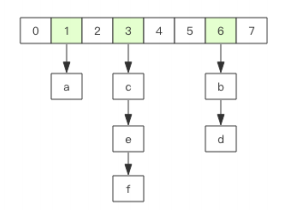
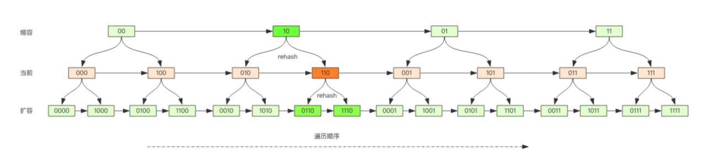

# redis 学习笔记 基础和应用

[toc]

## 1. redis基础数据结构

redis 所有的数据结构都以唯一的key字符串作为名称，通过key值获取value数据，不同类型的数据差异在于value不同

redis有5种基础数据结构

- string 字符串
- list 列表
- hash 字典
- set 集合
- zset 有序集合

### 1.1 string 字符串

- 动态字符串，可修改；

- 采用预分配冗余空间方式减少内存的频繁分配，图

- 实际分配空间capactity一般大于实际字符串长度len

- 字符串长度len小于1MB，扩容时加倍现有的空间；字符串长度len大于1MB，扩容时每次多扩1MB空间

- 字符串长度最大为512MB

  


##### 键值对

类似于字典的key-value 支持简单的增删改查  name时key helloRedis 是value

```bash
127.0.0.1:6379> set name helloRedis # 曾/改
OK
127.0.0.1:6379> get name #  查
"helloRedis"
127.0.0.1:6379> del name  # 删
(integer) 1
127.0.0.1:6379> get name 
(nil)

```


##### 批量键值对

```bash
127.0.0.1:6379> set name1 helloWorld
OK
127.0.0.1:6379> set name2 Redis
OK
127.0.0.1:6379> mget name1 name2 name3 # 返回一个列表
1) "helloWorld"
2) "Redis"
3) (nil)
127.0.0.1:6379> mset name1 python name2 java name3 golang # 批量赋值
OK
127.0.0.1:6379> mget name1 name2 name3
1) "python"
2) "java"
3) "golang"
127.0.0.1:6379> del name1 name2 name3 
(integer) 3


```

##### 过期和set命令扩展

对key设置过期时间，到期会自动被删除，常用来控制缓存失效时间

```bash
127.0.0.1:6379> set name helloworld 
OK
127.0.0.1:6379> expire name 5  # 设置过期时间为5s
(integer) 1
# 等待5s
127.0.0.1:6379> get name 
(nil)
127.0.0.1:6379> setex name 5  helloworld # 在赋值的时候同时设置过期时间
OK
127.0.0.1:6379> get name
(nil)
127.0.0.1:6379> setnx name helloworld # 如果name存在 就不执行set创建
(integer) 1
127.0.0.1:6379> get name
"helloworld"
127.0.0.1:6379> setnx name redis # name已经存在了,所以set创建不成功
(integer) 0
127.0.0.1:6379> get name 
"helloworld"
127.0.0.1:6379> 

```

The [SET](https://redis.io/commands/set) command supports a set of options that modify its behavior:

- `EX` *seconds* -- Set the specified expire time, in seconds.
- `PX` *milliseconds* -- Set the specified expire time, in milliseconds.
- `NX` -- Only set the key if it does not already exist.
- `XX` -- Only set the key if it already exist.
- `KEEPTTL` -- Retain the time to live associated with the key.（>=6.0 版本才有）

`setex key seconds calue` 相当于`set key value EX seconds`

`setnx psetex`类似  

建议使用set key value [options] 命令


##### 计数

若value值是整数，就可以对其进行自增操作，incr incrby 最大值最小值为64位有符号数的位置。

- incr key # 增加1
- incrby key increment # 增加increment 
- incrbyfloat key increment # 浮点数增加 

```bash
127.0.0.1:6379> set age 10
OK
127.0.0.1:6379> incr age
(integer) 11
127.0.0.1:6379> incrby age 12
(integer) 23
127.0.0.1:6379> set num 12.04
OK 
127.0.0.1:6379> incrbyfloat num 3.5
"15.54"

```


其他常用命令

| SET key value [EX seconds] [PX milliseconds] [NX\|XX] | ex 秒 px 毫秒 nx 键不存在时设置 xx 键存在时才设置            |
| ----------------------------------------------------- | ------------------------------------------------------------ |
| GET key                                               | 只能用于字符串                                               |
| GETSET key value                                      | 将键 `key` 的值设为 `value` ， 并返回键 `key` 在被设置之前的旧值。 |
| STRLEN key                                            | 返回键 `key` 储存的字符串值的长度。                          |
| APPEND key value                                      | 在key的值追加value                                           |
| SETRANGE key offset value                             | 从偏移量 `offset` 开始， 用 `value` 参数覆写(overwrite)键 `key` 储存的字符串值。不存在的键 `key` 当作空白字符串处理。 |
| GETRANGE key start end                                | 返回键 `key` 储存的字符串值的指定部分， 字符串的截取范围由 `start` 和 `end` 两个偏移量决定 (包括 `start` 和 `end` 在内)。 |
| DECR key                                              | 为键 `key` 储存的数字值减去一。                              |
| DECRBY key decrement                                  | 将键 `key` 储存的整数值减去减量 `decrement`                  |
| MSET key value [key value …]                          | 同时为多个键设置值                                           |
| MSETNX key value [key value …]                        | 当且仅当所有给定键都不存在时， 为所有给定键设置值。          |
| MGET key [key …]                                      | 返回给定的一个或多个字符串键的值。                           |


### 1.2 list 列表

- 需要注意的是，是链表为不是数组，是双向指针链表，因此 插入、删除较快，但是索引很慢

- 当列表弹出最后一个元素后，数据结构被自动删除，内存被回收。

- 常用来作异步队列使用。将需要延后处理的任务结构体序列化成字符串，塞进redis列表，另一个线程从这个列表中轮询数据进行处理

- 一个列表最多可以包含 232 - 1 个元素


##### 右进左出 ：队列

- 常用于消息排队和异步逻辑处理，确保元素的访问顺序性

```bash
127.0.0.1:6379>  rpush books python golang java cpp
(integer) 4
127.0.0.1:6379> llen books
(integer) 4
127.0.0.1:6379> lpop books
"python"
127.0.0.1:6379> lpop books
"golang"
127.0.0.1:6379> lpop books
"java"
127.0.0.1:6379> lpop books
"cpp"
127.0.0.1:6379> lpop books
(nil)
127.0.0.1:6379> 

```


##### 右进右出 ：栈

场景不多见

```bash
127.0.0.1:6379> rpush books python java golang 
(integer) 3
127.0.0.1:6379> llen books
(integer) 3
127.0.0.1:6379> rpop books
"golang"
127.0.0.1:6379> rpop books
"java"
127.0.0.1:6379> rpop books
"python"
127.0.0.1:6379> rpop books
(nil)
127.0.0.1:6379> 

```

##### 慢操作

- `LINDEX key index` 返回列表中 下标位 index的元素，index为负数的话，就是从列表末尾往前数，因为是链表 平均复杂度为O(n)
- `LTRIM key start stop` 对列表进行修剪，只保留指定区间内的元素[start stop]包括start、stop端点元素，可以用来实现定长列表


##### 快速列表

redis底层存储的是快速链表quicklist

- 在列表元素较少的情况下，使用一块连续的内存存储，结构是ziplist 压缩列表 
- 当数据量比较多的时候会改成quicklist，因为普通的链表需要的附加指针空间太大，浪费空间且加速内存的碎片化
- redis 将链表和ziplist结合起来组成quicklist，即将多个ziplist使用双向指针串起来使用。


##### 常用命令 

| LPUSH key value [value …]             | 将一个或多个值 `value` 依次插入到列表 `key` 的表头           |
| ------------------------------------- | ------------------------------------------------------------ |
| LPUSHX key value                      | 将值 value 插入到列表 key 的表头，当且仅当 key 存在并且是一个列表。 |
| RPUSH key value [value …]             | 将一个或多个值 `value` 插入到列表 `key` 的表尾(最右边)。     |
| RPUSHX key value                      | 将值 value 插入到列表 key 的表尾，当且仅当 key 存在并且是一个列表。 |
| LPOP key                              | 移除并返回列表 `key` 的头元素。                              |
| RPOP key                              | 移除并返回列表 `key` 的尾元素。                              |
| RPOPLPUSH source destination          | 将列表 source 中的最后一个元素(尾元素)弹出，并返回给客户端；将 source 弹出的元素插入到列表 destination ，作为 destination 列表的的头元素。 |
| LREM key count value                  | 根据参数 count 的值，移除列表中与参数 value 相等的元素；count>0.从表头向表尾搜索，移除与value相等的元素，数量为count。count<0，从表尾向表头搜索，移除与value相等的元素，数量为\|count\|，count=0，移除表中所有与 `value` 相等的值。 |
| LLEN key                              | 返回列表 key 的长度。                                        |
| LINDEX key index                      |                                                              |
| LINSERT key BEFORE\|AFTER pivot value | 将值 value 插入到列表 key 当中，位于值 pivot 之前或之后。    |
| LSET key index value                  | 将列表 key 下标为 index 的元素的值设置为 value 。            |
| LRANGE key start stop                 | 返回列表 key 中指定区间内的元素，区间以偏移量 start 和 stop 指定。 |
| LTRIM key start stop                  |                                                              |
| BLPOP key [key …] timeout             | BLPOP 是列表的阻塞式(blocking)弹出(LPOP key)原语。当给定列表内没有任何元素可供弹出的时候，连接将被 BLPOP 命令阻塞，直到等待超时或发现可弹出元素为止。 |
| BRPOP key [key …] timeout             | 它是 RPOP key 命令的阻塞版本，当给定列表内没有任何元素可供弹出的时候，连接将被 BRPOP 命令阻塞，直到等待超时或发现可弹出元素为止。当给定多个 key 参数时，按参数 key 的先后顺序依次检查各个列表，弹出第一个非空列表的尾部元素。 |
| BRPOPLPUSH source destination timeout | BRPOPLPUSH 是 RPOPLPUSH source destination 的阻塞版本，当给定列表 source 不为空时， BRPOPLPUSH 的表现和 RPOPLPUSH source destination 一样。当列表 source 为空时， BRPOPLPUSH 命令将阻塞连接，直到等待超时，或有另一个客户端对 source 执行 LPUSH key value [value …] 或 RPUSH key value [value …] 命令为止。超时参数 timeout 接受一个以秒为单位的数字作为值。超时参数设为 0 表示阻塞时间可以无限期延长(block indefinitely) 。 |
|                                       |                                                              |


### 1.3 hash 字典

- 无序字典，内部存储很多键值对
- 实现结构 数组+链表的二维结构
- 第一维的hash的数组位置碰撞，会将碰撞的元素使用链表串联起来
- redis字典的value只能是字符串
- 为追求高性能、不阻塞服务，采用渐进式rehash策略；
- 当hash移除了最后一个元素，数组结构被自动删除，内存被回收
- 缺点 ：hash结构的存储要高于单个字符串

常用命令：

| HSET hash field value                 | 将哈希表 hash 中域 field 的值设置为 value 。                 |
| ------------------------------------- | ------------------------------------------------------------ |
| HSETNX hash field value               | 当且仅当域 field 尚未存在于哈希表的情况下， 将它的值设置为 value 。 |
| HGET hash field                       | 返回哈希表中给定域的值。                                     |
| HDEL key field [field …]              | 删除哈希表 key 中的一个或多个指定域，不存在的域将被忽略。    |
| HLEN key                              | 返回哈希表 key 中域的数量。                                  |
| HSTRLEN key field                     | 返回哈希表 key 中， 与给定域 field 相关联的值的字符串长度（string length） |
| HINCRBY key field increment           | 为哈希表 key 中的域 field 的值加上增量 increment 。增量也可以为负数，相当于对给定域进行减法操作 |
| HINCRBYFLOAT key field increment      | 为哈希表 key 中的域 field 加上浮点数增量 increment 。        |
| HMSET key field value [field value …] | 同时将多个 field-value (域-值)对设置到哈希表 key 中。        |
| HMGET key field [field …]             | 返回哈希表 key 中，一个或多个给定域的值。                    |
| HKEYS key                             | 返回哈希表 key 中的所有域。                                  |
| HGETALL key                           | 返回哈希表 key 中，所有的域和值。                            |
| HVALS key                             | 返回哈希表 `key` 中所有域的值。                              |

```bash
127.0.0.1:6379> hset books java "think in java" # 命令行的字符串包含空格，需要用引号括起来
(integer) 1
127.0.0.1:6379> hset books golang "study go" # 
(integer) 1
127.0.0.1:6379> hset books python "machine learning with python"
(integer) 1
127.0.0.1:6379> hgetall books
1) "java"
2) "think in java"
3) "golang"
4) "study go"
5) "python"
6) "machine learning with python"
127.0.0.1:6379> hlen books
(integer) 3
127.0.0.1:6379> hget books golang
"study go"
127.0.0.1:6379> hset books java "learning java programming"
(integer) 0
127.0.0.1:6379> hget books java
"learning java programming"
127.0.0.1:6379> hmset books java "effective java" python "study python" golang "modern golang programming"
OK
127.0.0.1:6379> hgetall books
1) "java"
2) "effective java"
3) "golang"
4) "modern golang programming"
5) "python"
6) "study python"
127.0.0.1:6379> 

```

### 1.4 set集合

- 内部的键值对是无序且唯一的
- 内部实现相当于特殊的字典，字典中所有的valu都是一个值null
- 当set移除了最后一个元素，数组结构被自动删除，内存被回收
- 主要是去重功能

| SADD key member [member …]      | 将一个或多个 `member` 元素加入到集合 `key` 当中，已经存在于集合的 `member` 元素将被忽略。 |
| ------------------------------- | ------------------------------------------------------------ |
| SISMEMBER key member            | 判断 `member` 元素是否集合 `key` 的成员。                    |
| SPOP key                        | 移除并返回集合中的一个随机元素。                             |
| SRANDMEMBER key [count]         | 如果命令执行时，只提供了 key 参数，那么返回集合中的一个随机元素。count为正数，且小于集合数，返回一个包含 `count` 个元素的数组，数组中的元素**各不相同**，大于集合数，返回整个集合；count为负数，数组中的元素可能会重复出现多次，而数组的长度为 count 的绝对值 |
| SREM key member [member …]      | 移除集合 key 中的一个或多个 member 元素，不存在的 member 元素会被忽略。 |
| SMOVE source destination member | 将 member 元素从 source 集合移动到 destination 集合。原子操作 |
| SCARD key                       | 返回集合 key 的基数(集合中元素的数量)。                      |
| SMEMBERS key                    | 返回集合 key 中的所有成员。                                  |

```bash

127.0.0.1:6379> sadd books python
(integer) 1
127.0.0.1:6379> sadd books python # 重复
(integer) 0
127.0.0.1:6379> sadd books java golang
(integer) 2
127.0.0.1:6379> smembers books  #set无序
1) "java"
2) "python"
3) "golang"
127.0.0.1:6379> sismember books java #查询某个value是否存在
(integer) 1
127.0.0.1:6379> sismember books cpp
(integer) 0
127.0.0.1:6379> scard books # 获取长度
(integer) 3
127.0.0.1:6379> spop books
"golang"
127.0.0.1:6379> 

```

### 1.5 zset 有序列表

- 一方面适是个集合，保证value的唯一性，另一方面可以给每个value一个score，代表value的排序权重
- 内部实现 跳跃列表z
- 当zset移除了最后一个元素，数组结构被自动删除，内存被回收

| ZADD key score member [[score member] [score member] …]      | 将一个或多个 member 元素及其 score 值加入到有序集 key 当中。并通过重新插入这个 member 元素，来保证该 member 在正确的位置上。score 值可以是整数值或双精度浮点数。 |
| ------------------------------------------------------------ | ------------------------------------------------------------ |
| ZSCORE key member                                            | 返回有序集 key 中，成员 member 的 score 值。                 |
| ZINCRBY key increment member                                 | 为有序集 key 的成员 member 的 score 值加上增量 increment 。  |
| ZCARD key                                                    | 返回有序集 `key` 的基数(数量)                                |
| ZCOUNT key min max                                           | 返回有序集 key 中， score 值在 min 和 max 之间(默认包括 score 值等于 min 或 max )的成员的数量。 |
| ZRANGE key start stop [WITHSCORES]                           | 返回有序集 key 中，指定区间内的成员。其中成员的位置按 score 值递增(从小到大)来排序。具有相同 score 值的成员按字典序(lexicographical order )来排列。 |
| ZREVRANGE key start stop [WITHSCORES]                        | 返回有序集 key 中，指定区间内的成员。其中成员的位置按 score 值递减(从大到小)来排列。 具有相同 score 值的成员按字典序的逆序(reverse lexicographical order)排列。 |
| ZRANGEBYSCORE key min max [WITHSCORES] [LIMIT offset count]  | 返回有序集 key 中，所有 score 值介于 min 和 max 之间(包括等于 min 或 max )的成员。有序集成员按 score 值递增(从小到大)次序排列。具有相同 score 值的成员按字典序(lexicographical order)来排列(该属性是有序集提供的，不需要额外的计算)。可选的 LIMIT 参数指定返回结果的数量及区间(就像SQL中的 SELECT LIMIT offset, count )，可选的 WITHSCORES 参数决定结果集是单单返回有序集的成员，还是将有序集成员及其 score 值一起返回，min 和 max 可以是 -inf 和 +inf ，这样一来，你就可以在不知道有序集的最低和最高 score 值的情况下，使用 ZRANGEBYSCORE 这类命令 |
| ZREVRANGEBYSCORE key max min [WITHSCORES] [LIMIT offset count] | 返回有序集 key 中， score 值介于 max 和 min 之间(默认包括等于 max 或 min )的所有的成员。有序集成员按 score 值递减(从大到小)的次序排列。具有相同 score 值的成员按字典序的逆序(reverse lexicographical order )排列。 |
| ZRANK key member                                             | 返回有序集 key 中成员 member 的排名。其中有序集成员按 score 值递增(从小到大)顺序排列。排名以 0 为底，也就是说， score 值最小的成员排名为 0 。 |
| ZREM key member [member …]                                   | 移除有序集 key 中的一个或多个成员，不存在的成员将被忽略。    |
| ZREMRANGEBYRANK key start stop                               | 移除有序集 key 中，指定排名(rank)区间内的所有成员。区间分别以下标参数 start 和 stop 指出，包含 start 和 stop 在内。下标参数 start 和 stop 都以 0 为底，也就是说，以 0 表示有序集第一个成员，以 1 表示有序集第二个成员，以此类推。 你也可以使用负数下标，以 -1 表示最后一个成员， -2 表示倒数第二个成员，以此类推。 |
| ZREMRANGEBYSCORE key min max                                 | 移除有序集 key 中，所有 score 值介于 min 和 max 之间(包括等于 min 或 max )的成员。 |
| ZRANGEBYLEX key min max [LIMIT offset count]                 | 当有序集合的所有成员都具有相同的分值时， 有序集合的元素会根据成员的字典序（lexicographical ordering）来进行排序， 而这个命令则可以返回给定的有序集合键 key 中， 值介于 min 和 max 之间的成员。<br/><br/>如果有序集合里面的成员带有不同的分值， 那么命令返回的结果是未指定的（unspecified）。可选的 LIMIT offset count 参数用于获取指定范围内的匹配元素 （就像 SQL 中的 SELECT LIMIT offset count 语句） |
| ZLEXCOUNT key min max                                        | 对于一个所有成员的分值都相同的有序集合键 key 来说， 这个命令会返回该集合中， 成员介于 min 和 max 范围内的元素数量。 |
| ZREMRANGEBYLEX key min max                                   | 对于一个所有成员的分值都相同的有序集合键 key 来说， 这个命令会移除该集合中， 成员介于 min 和 max 范围内的所有元素。 |


```bash
127.0.0.1:6379> zadd books 9.0 "think in java"
(integer) 1
127.0.0.1:6379> zadd books 8.9 "java concurrency"
(integer) 1
127.0.0.1:6379> zadd books 8.6 "java cookbook"
(integer) 1
127.0.0.1:6379> zrange books 0 -1  #按score排序列出，参数区间为排名范围
1) "java cookbook"
2) "java concurrency"
3) "think in java"
127.0.0.1:6379> zrange books 0 -1 withscores
1) "java cookbook"
2) "8.5999999999999996"
3) "java concurrency"
4) "8.9000000000000004"
5) "think in java"
6) "9"
127.0.0.1:6379> zrevrange books 0 -1  #按score逆序列出，参数区间为排名范围
1) "think in java"
2) "java concurrency"
3) "java cookbook"
127.0.0.1:6379> zcard books  #算总数
(integer) 3
127.0.0.1:6379> zscore books "java cookbook"# 获取指定value的score
"8.5999999999999996"
127.0.0.1:6379> zrank books "java cookbook" # 获取排名
(integer) 0
127.0.0.1:6379> zrangebyscore books 0 8.91# 根据score区间遍历zset
1) "java cookbook"
2) "java concurrency"
127.0.0.1:6379> zrangebyscore books -inf 8.91 withscores # inf 代表无穷
1) "java cookbook"
2) "8.5999999999999996"
3) "java concurrency"
4) "8.9000000000000004"
127.0.0.1:6379> zrem books "java concurrency"  # 删除value 
(integer) 1
127.0.0.1:6379> zrange books 0 -1
1) "java cookbook"
2) "think in java"

```


### 1.6 容器型数据的通用规则

容器型数据： list、set、hash、zset

两个规则：

- create if not exists： 如果不存在，就创建一个、再操作
- drop if no elements ： 如果元素里的元素没了，就立即删除容器、释放内存


### 1.7 过期时间

所有数据都可以设置过期时间，时间一到，自动删除相应对象

注意：若一个字符串已经设置了过期时间，再调用set方法修改、过期时间会失效。


## 2 分布式锁

### 2.1 分布式锁的奥义

redis 锁主要式利用setnx命令

- 加锁： SETNX key value 当键不存在时，对键进行设置操作并返回成功，否则返回失败。KEY 是锁的唯一标识，一般按业务来决定命名。
- 解锁命令：DEL key，通过删除键值对释放锁，以便其他线程可以通过 SETNX 命令来获取锁。
- 锁超时：EXPIRE key timeout, 设置 key 的超时时间，以保证即使锁没有被显式释放，锁也可以在一定时间后自动释放，避免资源被永远锁住。

redis 2.8版本 中  作者 改变了set指令的扩展参数，使得setnx 和expire 可以一起执行。

`set key value ex 5 nx  `

这个命令就是setnx和expire组合一起的原子指令。

### 2.2 超时问题 

redis的分布式锁不能解决超时问题。在加锁与解锁之间的逻辑执行时间太长，超出了锁的超时限制，会出现问题。

比如： 线程A在没有执行临界区的代码情况下，持有的锁过期了，线程B加锁，导致临界区的代码不能严格串行执行。

故 redis分布式锁 不能用于较长时间任务


**稍微安全一点的方案**

```
tag=random.nextint() #随机数
if redis.set(key,tag,nx=true,ex=5):
	do_something()
	redis.delifequals(key,tag) # 假象的del id equals 指令
```

将set指令的value 设定为随机数，释放时 先匹配随机数师是否一致，然后再删除key。

确保当前线程占有的锁 不会被其他线程释放。 被释放的可能只有时间到期 被服务器释放。

要保证匹配value和删除key是一个原子操作，redis无此指令需要lua脚本来处理，保证原子性。


**相对安全** 并不完美 真超时了，其他线程会乘虚而入


### 2.3 可重入性

可重入性 指： 线程持有锁的情况下，再次加锁，如果一个锁支持同一个线程的多次加锁，这个锁就是可重入的。

redis分布式锁支持可重入，即 对set方法进行包装

```python

import threading

import redis

locks = threading.local()
locks.redis = {}

def key_for(user_id):
    return "account_{}".format(user_id)

def _lock(client, key):
    return bool(client.set(key,'True',nx=True,ex=5))

def _ulock(client, key):
    client.delete(key)

def lock(client, user_id):
    key = key_for(user_id)
    
    if key in locks.redis:
        locks.redis[key] += 1
        return True
    ok = _lock(client, key)
    if not ok:
        return False
    locks.redis[key] = 1
    return True

def unlock(client, user_id):
    key = key_for(user_id)
    if key in locks.redis:
        locks.redis[key] -= 1
        if locks.redis[key] <= 0:
            del locks.redis[key]
        return True
    return False


client = redis.StrictRedis()
print("lock", lock(client, "codehole"))
print("lock", lock(client, "codehole"))
print("unlock", unlock(client, "codehole"))
print("unlock", unlock(client, "codehole"))
```

尽量不使用可重入锁


## 3 延时队列

对于只有一组消费者的消息队列，在没有对可靠性严格要求的情况下，redis可以搞定。

### 3.1 异步消息队列

redis的list数据结构常用来作为异步消息队列使用。rpush和lpush操作入队列，用lpop和rpop操作出队列。

### 3.2 队列为空的情况

为了防止空轮询造成的高cpu消耗和redis的高qps。使用sleep解决，若pop操作返回nil，则让该线程睡一会儿。

### 3.3 阻塞读

用睡眠的方法会导致消息延长增大，可以用blpop/brpop指令。b(blocking)

阻塞都在队列没有数据的时候，会立即进入休眠状态，一旦数据到来，则立刻醒过来，消息的延迟几乎为0.

### 3.4空闲连接自动断开

但是 如果线程一直阻塞，redis客户端就变成了闲置连接，闲置过久，服务器会主动断开连接，blpop/brpop会抛出异常。


总结来说，用blpop/brpop命令解决队列为空的问题，同时客户端要对异常进行处理。

### 3.5 锁冲突处理

加锁失败，常用处理：

- 直接抛出异常，通知用户稍后重试。
- sleep一会，再重试
- 将请求转移至延时队列，过一会儿再试。

##### 直接抛出特定类型的异常

适合用户直接发起的请求。本质是用户对当前请求的放弃，由用户决定是否重新发起新的请求。

##### sleep

阻塞当前的消息处理线程，会导致队列的后续消息处理出现延迟。不适合队列消息较多的情况

##### 延时队列

适合异步消息处理


### 3.6 延时队列的实现

可通过redis的zset实现。将消息序列化为一个字符串作为zset的value，这个消息的到期处理时间作为score。用多个线程轮询zset获取到期的任务进行处理。

多个线程是为了保障可用性，万一挂了一个线程还有其他线程可以继续处理。

同时要考虑并发抢任务，确保任务不会被多次执行。

```python
# 延时队列实现
def delay(msg):
    msg.id=str(uuid.uuid4())# 保证value值为唯一
    value=json.dumps(msg)
    retry_ts=time.time()+5 # 5s后重试
    redis.zadd("delap-queue",retry_ts,value)
def loop():
    while True:
        values=redis.zrangebyscore("delay-queue",0,time.time(),start=0,num=1)
        if not values:
            time.sleep(1) # 延时队列为空 休息1s
            continue
        value=value[0]
        success=redis.zrem("delay-queue",value)# 从队列中移除消息
        if success:
            # 有多进程并发的可能，但只有一个进程可以抢到消息。
            msg=json.loads(value)
            handle_msg(msg)# 注意对hande_msg进行异常捕获。
```

## 4 位图

位图是byte数组可以使用普通的get/set直接获取和设置整个位图的内容，也可以使用位图来操作getbit/setbit等将byte数组看成”位数组“来处理

### 4.1 基本用法 

redis的位数组是自动扩展的，会进行零扩充。

- 零存整取 

```bash
127.0.0.1:6379> setbit s 1 1
(integer) 0
127.0.0.1:6379> setbit s 2 1
(integer) 0
127.0.0.1:6379> setbit s 4 1
(integer) 0
127.0.0.1:6379> setbit s 9 1
(integer) 0
127.0.0.1:6379> setbit s 10 1
(integer) 0
127.0.0.1:6379> setbit s 13 1
(integer) 0
127.0.0.1:6379> setbit s 15 1
(integer) 0
127.0.0.1:6379> get s
"he"

```

- 零存零取

  ```bash
  127.0.0.1:6379> setbit w 1 1
  (integer) 0
  127.0.0.1:6379> setbit w 2 1
  (integer) 0
  127.0.0.1:6379> setbit w 4 1
  (integer) 0
  127.0.0.1:6379> getbit w 1
  (integer) 1
  127.0.0.1:6379> getbit w 1
  (integer) 1
  127.0.0.1:6379> getbit w 2
  (integer) 1
  127.0.0.1:6379> getbit w 4
  (integer) 1
  127.0.0.1:6379> getbit w 5
  (integer) 0
  
  ```


- 整存零取

```bash
127.0.0.1:6379> set w h
OK
127.0.0.1:6379> getbit w 1
(integer) 1
127.0.0.1:6379> getbit w 2
(integer) 1
127.0.0.1:6379> getbit w 4
(integer) 1
127.0.0.1:6379> getbit w 5
(integer) 0

```

### 4.2 统计和查找

位图统计指令bitcount 统计指定范围内1的个数

位图查找指令 bitpos 指定范围内出现的第一个0或者1

因为start end的参数是byte字节索引，指定的位范围只能是8的倍数。

```
127.0.0.1:6379> set w hello
OK
127.0.0.1:6379> bitcount w
(integer) 21
127.0.0.1:6379> bitcount w 0 0 # 第一个字符中1的位数
(integer) 3
127.0.0.1:6379> bitcount w 0 1 # 前两个字符中1的位数
(integer) 7
127.0.0.1:6379> bitpos w 0 #第一个0位
(integer) 0
127.0.0.1:6379> bitpos w 1 #第一个1位
(integer) 1
127.0.0.1:6379> bitpos w 1  1 1 从第二个字符 算起 第一个1位
(integer) 9
127.0.0.1:6379> bitpos w 1  2 2 从第3个字符 算起 第一个1位
(integer) 17

```

### 4.3 魔术指令 

bitfiled指令可以一次操作多个位，有3个子指令 get set incrby。但是一次只能处理64个连续的位，就要使用多个子命令 bitfiled可以一次执行多个子命令

```
127.0.0.1:6379> set w hello
OK
127.0.0.1:6379> bitfield w get u4 0 # 从第一个位开始 取4个位，结果是无符号数（u）
1) (integer) 6
127.0.0.1:6379> bitfield w get u3 2  # 从第三个位开始 取3个位，结果是无符号数（u）
1) (integer) 5
127.0.0.1:6379> bitfield w get i4 3  #从第4个位开始 取4个位，结果是有符号数（i）
1) (integer) 4
127.0.0.1:6379> bitfield w get i3 2   #从第3个位开始 取3个位，结果是有符号数（i）
1) (integer) -3
127.0.0.1:6379> 

```

有符号数 指 获取的位数组中的第一个位是符号位，剩下的是值。

redis interger 是有符号数，最大64位。

故无符号数 只能传63位。

一次执行多个指令

```
127.0.0.1:6379> bitfield w get u4 0 get u3 2 get i4 9 get i3 2 
1) (integer) 6
2) (integer) 5
3) (integer) -4
4) (integer) -3

```

将第二个字符e 改为a

```
127.0.0.1:6379> bitfield w set u8 8 97
1) (integer) 101
127.0.0.1:6379> get w
"hallo"

```

incrby 对指定范围被内的位进行自增操作，若出现溢出，默认处理时折返，即将溢出的符号位丢掉。也可以选择失败不执行或者饱和截断。

```
127.0.0.1:6379> set w hello
OK
127.0.0.1:6379> bitfield w incrby u4 2 1 # 从第3位开始，对接下来的4位无符号数+1
1) (integer) 11
127.0.0.1:6379> bitfield w incrby u4 2 1
1) (integer) 12
127.0.0.1:6379> bitfield w incrby u4 2 1
1) (integer) 13
127.0.0.1:6379> bitfield w incrby u4 2 1
1) (integer) 14
127.0.0.1:6379> bitfield w incrby u4 2 1
1) (integer) 15
127.0.0.1:6379> bitfield w incrby u4 2 1 # 溢出折返了
1) (integer) 0

```

溢出策略子命令 overflow  默认折返wrap 也可以fail或者sat

##### 饱和截断 sat

```
127.0.0.1:6379> set w hello
OK
127.0.0.1:6379> bitfield w overflow sat incrby u4 2 1
1) (integer) 11
127.0.0.1:6379> bitfield w overflow sat incrby u4 2 1
1) (integer) 12
127.0.0.1:6379> bitfield w overflow sat incrby u4 2 1
1) (integer) 13
127.0.0.1:6379> bitfield w overflow sat incrby u4 2 1
1) (integer) 14
127.0.0.1:6379> bitfield w overflow sat incrby u4 2 1
1) (integer) 15
127.0.0.1:6379> bitfield w overflow sat incrby u4 2 1 # 饱和截断 保持最大值
1) (integer) 15

```

##### 失败不执行 fail

```
127.0.0.1:6379> set w hello 
OK
127.0.0.1:6379> bitfield w overflow fail incrby u4 2 1
1) (integer) 11
127.0.0.1:6379> bitfield w overflow fail incrby u4 2 1
1) (integer) 12
127.0.0.1:6379> bitfield w overflow fail incrby u4 2 1
1) (integer) 13
127.0.0.1:6379> bitfield w overflow fail incrby u4 2 1
1) (integer) 14
127.0.0.1:6379> bitfield w overflow fail incrby u4 2 1
1) (integer) 15
127.0.0.1:6379> bitfield w overflow fail incrby u4 2 1  # 不执行 
1) (nil)

```

## 5 HyperLogLog

HyperLogLog是redis的高级数据结构，常用来进行基数统计。提供不精确的去重计数方案，标准误差为0.81%

### 5.1 使用方法

pfadd 指令 增加计数

pfcount指令 获取计数值

pfmerge指令 将多个pf计数值累加到一起形成一个新的pf值

```python
import redis

client=redis.StrictRedis()
client.delete("codehole")
for i in range(1000):
    client.pfadd("codehole", "user%id" % i)
    total = client.pfcount("codehole")
    if total != i + 1:
        print(total ,i+1)
        break

# 输出 129 128 
```

经过多次计算，当加到第129个的时候，开始出现误差。

### 5.2 注意事项

HyperLogLog数据结构占据12kB是数据存储空间。不适合单个用户相关的统计。

redis对HyperLogLog数据存储做了优化，在计数较小时，采用稀疏矩阵存储，空间占用较小。

随着计数越来越多，稀疏矩阵占用空间超过阈值，一次性转变成稠密矩阵，这时 会占用12KB的存储空间

### 5.3 HyperLogLog实现原理


如图，给定一系列随机数，用maxbit记录地位连续零位的最大长度k。可以通过K值估算出随机数的数量N。

```python
import math

import random

# 算出低位0的个数
def low_zeros(value):
    for i in range(1, 32):
        if value >> i << i != value:
            break
    return i - 1
    

# 通过随机数记录最大的低位零的个数
class BitKepper(object):
    def __init__(self):
        self.maxbits = 0
    def random(self):
        value = random.randint(0, 2 ** 32 - 1)
        bits = low_zeros(value)
        if bits > self.maxbits:
            self.maxbits = bits

class Experimernt(object):
    def __init__(self, n):
        self.n = n
        self.keeper = BitKepper()
    
    def do(self):
        for i in range(self.n):
            self.keeper.random()
        
    def debug(self):
        print(self.n,"%.2f"%math.log(self.n,2),self.keeper.maxbits)
        

for i in range(1000, 100000, 100):
    exp = Experimernt(i)
    exp.do()
    exp.debug()
```

根据计算结果 可以得出  $N=2^k$  约等于。只是粗略的估算，因为加入N介于$2^k$和$2^{k+1}$

```python
import math

import random

# 算出低位0的个数


def low_zeros(value):
    for i in range(1, 32):
        if value >> i << i != value:
            break
    return i - 1


# 通过随机数记录最大的低位零的个数
class BitKepper(object):
    def __init__(self):
        self.maxbits = 0

    def random(self, m):
        bits = low_zeros(m)
        if bits > self.maxbits:
            self.maxbits = bits


class Experimernt(object):
    def __init__(self, n, k=1024):
        self.n = n
        self.k = k
        self.keepers = [BitKepper() for i in range(k)]

    def do(self):
        for i in range(self.n):
            m = random.randint(0, 2 ** 32 - 1)
            # 确保同一个整数被分到同一个桶里面，摘取高位后取模
            keeper = self.keepers[((m & 0xfff0000) >> 16) % len(self.keepers)]
            keeper.random(m)

    def estimate(self):
        sumbits_ivese = 0 # 零位数的倒数
        for keeper in self.keepers:
            sumbits_ivese+=1.0/float(keeper.maxbits)
        avgbits = float(self.k) / sumbits_ivese  #平均零位数 
        return 2**avgbits*self.k

for i in range(100000, 1000000, 100000):
    exp = Experimernt(i)
    exp.do()
    est=exp.estimate()
    print(i,'%.2f'%est,'%.2f'%(abs(est-i)/i))
```

输出为：

```
100000 91970.67 0.08
200000 195830.67 0.02
300000 282780.27 0.06
400000 415715.54 0.04
500000 501844.69 0.00
600000 619793.37 0.03
700000 752122.99 0.07
800000 792946.57 0.01
900000 928934.55 0.03
```

第一列为实际数量，第二列为用公式估计输来的数量 第3列为误差率。

实际的HyperLogLog比示例代码更复杂，也更准确。但是它的原理大概是这样，即根据一个随机数集合的位连续零位的最大值k，估算这批随机数的具体个数。

### 5.4 pf内存占用12kB的原因

在上面的示例代码中 ，使用了1024个桶计算，而在redis中，实际有16384（$2^{14}$）.

每个maxbits占6个bits(最大63)，即占用内存为$2^{14}*6/8$  B=12KB

## 6 布隆过滤器

布隆过滤器是一种高级数据结构，用来解决数据去重问题。

可以理解为不精确的set结构。

布隆过滤器可以准确的判断某个element是不是已经被添加过。但是对于未被添加过的element，布隆过滤器可能会误判。

即 已经添加过的，会准备判断；为添加过的，存在极小的几率认为已经添加过。

### 6.1 redis安装布隆过滤器

- 下载：`wgethttps://github.com/RedisBloom/RedisBloom/archive/v2.2.3.tar.gz `
- 解压： `tar xzvf v2.2.3.tar.gz`
- cd 进入解压的文件夹 
- 编译 make  得到 redisbloom.so文件
- 在redis.conf中 添加 `loadmodule  /pathto/ redisbloom.so`
- 启动redis-server即可

### 6.2 布隆过滤器的基本用法

`bf.add`添加元素 一次添加一个元素  `bf.mdd`一次添加多个元素

`bf.exists`查询元素是否存在。`bf.mexists`一次查询多个元素

```python
import redis

client = redis.StrictRedis(host='localhost', port=6379)
client.delete("codehole")

for i in range(100000):
    client.execute_command("bf.add", "codehole", "user%d" % i)
    # i+1是当前没见过的
    ret = client.execute_command("bf.exists", "codehole", "user%d" %(i+1))
    if ret == 1:
        print(i)
        break
```

输出314 表示在插入第314个元素的时候 出现了误判

```python
# 计算误判率

import redis
import random

client = redis.StrictRedis(host='localhost', port=6379)

CHARS = ''.join([chr(ord('a') + i)
                 for i in range(26)])  # abcdefghijklmnopqrstuvwxyz

def random_string(n):
    chars = []
    for i in range(n):
        idx = random.randint(0, len(CHARS) - 1)
        chars.append(CHARS[idx])
    return ''.join(chars)

users = list(set([random_string(64) for i in range(100000)]))
print("total users", len(users))

users_train = users[:len(users)//2]
users_test = users[len(users)//2:]

client.delete("codehole")

falses = 0

for user in users_train:
    client.execute_command("bf.add", "codehole", user)
print("all trained")

for user in users_test:
    ret = client.execute_command("bf.exists", "codehole", user)
    if ret == 1:
        falses += 1

print(falses,len(users_test),falses/len(users_test))
```

输出：

```
total users 100000
all trained
599 50000 0.01198
```

误判率大约1%，这个是默认的参数。

还可以使用自定义参数的布隆过滤器，

在add之前 用`bf.reserve`命令显式创建。

3个参数 key error_rate initial_size

- key 若已经存在 就报错
- error_rate 越低 需要的空间越大
- initial_size 表示预计放入的元素数量当实际数量超出这个数值时，误判率会上升。

默认的error_rate是0.01 initial_size是100

需要注意的是：

- initial_size:过大，浪费存储空间，过小 影响准确率
- error_rate :越小 ，需要的存储空间越大。

```python
# 计算误判率

import redis
import random

client = redis.StrictRedis(host='localhost', port=6379)

CHARS = ''.join([chr(ord('a') + i)
                 for i in range(26)])  # abcdefghijklmnopqrstuvwxyz

def random_string(n):
    chars = []
    for i in range(n):
        idx = random.randint(0, len(CHARS) - 1)
        chars.append(CHARS[idx])
    return ''.join(chars)

users = list(set([random_string(64) for i in range(100000)]))
print("total users", len(users))

users_train = users[:len(users)//2]
users_test = users[len(users)//2:]

client.delete("codehole")

falses = 0

client.execute_command("bf.reserve","codehole",0.0001,50000)

for user in users_train:
    client.execute_command("bf.add", "codehole", user)
print("all trained")

for user in users_test:
    ret = client.execute_command("bf.exists", "codehole", user)
    if ret == 1:
        falses += 1

print(falses,len(users_test),falses/len(users_test))
```

输出：

```
total users 100000
all trained
5 50000 0.0001
```

改变参数后，误判率低了。

实际元素超出时，误判率会随着元素的增加 呈S型曲线增加

公式：

$F=(1-0.5^t)^k$ 其中 k hash函数最佳数量 t 实际数量与预计数量的倍数。

### 6.3 布隆过滤器的原理


如图，布隆过滤器对应得redis数据结构是一个大型的位数组和几个不同的无偏哈希函数。图中，f，g，h代表哈希函数，无偏指的是元素的哈希算得较为均匀。

添加key时，多个hash函数对key进行hash，算出一个整数索引值，然后对位数组长度进行取模运算得到一个位置，每个哈希函数都会算出不同得位置，再将位数组中的这几个位置职位一，完成add操作。

当实际元素数量超出初始元素数量时，应对布隆过滤器重建。

### 6.4 空间占用统计

需要两个参数：

- 预计元素的数量n
- 错误率f

公式：

$k=0.7*(L/n)$

$f=0.6185^{L/n}$

利用这两个公式可以得到：

- 位数组的长度L，即需要的存储空间bit
- hash函数的最佳数量K

## 7 简单限流

限流的目的是控制流量和控制用户行为

### 7.1 简单限流策略解决方案

比如限定某个用户某个行为在一定时间内只发生N次。

需要一个固定宽度的时间滑动茶窗口。

用zset结构记录用户的行为历史，每一个行为作为zset中的key保存下来，value

为保证唯一性可用uuid或者时间戳生成。score用时间戳，圈定时间窗口

```python

import  redis
import time

client = redis.StrictRedis()

def is_action_allowed(user_id, action_key, period, max_count):
    key = 'hist:%s:%s' % (user_id, action_key)
    now_ts = int(time.time() * 1000) # 毫秒时间戳
    with client.pipeline() as pipe:
        # 记录行为
        # value和score 使用毫秒时间戳
        pipe.zadd(key, {now_ts: now_ts})
        # 移除时间窗口外的行为数据，剩下的都是时间窗口内的
        pipe.zremrangebyscore(key, 0, now_ts - period * 1000)
        # 获取窗口内的行为数量
        pipe.zcard(key)
        # 设置行为过期期限，比period多一妙
        pipe.expire(key, period + 10)
        # 批量执行pipe内的命令。
        _, _, current_count, _ = pipe.execute()
    #比较数量是否超标。
    return current_count, max_count, current_count<=max_count
    

for i in range(20):
    print(i,is_action_allowed("user1","reply",60,5))
```

注意：这段代码中 判断前已经实际插入了。需要修改

简单限流不适用于一定时间内次数较大的情况，因为它记录了时间窗口内所有的行为。会消耗大量的存储空间


## 8 漏斗限流

漏斗的剩余空间代表当前行为可以持续的数量，漏嘴的流水速率，代表系统允许该行为的最大频率。

```python
# 模拟 单机漏斗算法
import time
import random

class Funnel(object):
    def __init__(self,capacity,leaking_rate):
        self.capacity = capacity              # 漏斗容量
        self.leaking_rate = leaking_rate  # 漏嘴流水速率
        self.left_quota = capacity        # 漏斗剩余空间
        self.leaking_ts = time.time()  # 上一次漏水时间
        
    def make_spcke(self):
        now_ts = time.time()
        # 距离上一次漏水过去的时间
        delta_ts = now_ts - self.leaking_ts
        #可以腾出的空间
        delta_quota = delta_ts * self.leaking_rate
        # 若腾出的空间太少，就放弃
        if delta_quota < 1:
            return
        self.left_quota += delta_quota  # 增加剩余空间
        self.leaking_ts = now_ts  # 记录漏水时间
        if self.left_quota > self.capacity:
            self.left_quota = self.capacity
        
    def watering(self, quota):
        self.make_spcke()
        if self.left_quota >= quota:
            self.left_quota -= quota
            return True
        return False


funnels = {}
# 所有的漏斗


def is_action_allowed(user_id, action_key, capacity, leaking_rate):
    """
    capacity 漏斗容量 \n
    leaking_rate 漏嘴流水速率 quota/s
    """
    key = '%s:%s' % (user_id, action_key)
    funnel = funnels.get(key)
    if not funnel:
        funnel = Funnel(capacity, leaking_rate)
        funnels[key] = funnel
    return funnel.watering(1)


for i in range(30):
    x=random.random()
    time.sleep(x)
    print(i,is_action_allowed("digua","reply",15,0.5))
```

输出：

```
0 True
1 True
2 True
3 True
4 True
5 True
6 True
7 True
8 True
9 True
10 True
11 True
12 True
13 True
14 True
15 True
16 True
17 True
18 True
19 False
20 False
21 False
22 True
23 False
24 False
25 True
26 True
27 False
28 False
29 False
```

以上是单机版的实现。

### 8.1redis-cell 

redis4.0提供了一个限流模块redis-cell，该模块使用漏斗算法，并提供原子的限流指令。

```markdown
CL.THROTTLE     user123    15     30    60     1
                                       ▲            ▲    ▲      ▲   ▲
                                        |                |        |        |   └───── apply 1 token (default if omitted)
                                        |                |      └─┴─────── 30 tokens / 60 seconds
                                        |              └───────────── 15 max_burst
               						  └─────────────────── key "user123"
```


```
127.0.0.1:6379> cl.throttle user1:reply 15 30 60 1 
1) (integer) 0      # 0表示允许 1表示拒绝
2) (integer) 16    # 漏斗容量 值为(max_brust+1)
3) (integer) 15    # 漏斗剩余容量
4) (integer) -1     # 如果被拒绝了 需要多长时间再试
5) (integer) 2      # 多场时间后，漏斗完全空出来

```

- user1:reply 是key值

- 15 max_brust值

- 30  operations/60 seconds 漏水速率， 表示每60秒允许执行30个操作

- need 1 token（可选参数，默认值是1）表示本次占用的令牌数

  

## 9 GeoHash

redis3.2 增加了地理位置Geo模块，应用：附近的xxxx 

### 9.1 用数据库算附近的人

假设元素的经纬坐标使用关系数据库(元素id,经度x，纬度y)

一般方法是通过矩形区域，来限定元素的数量，然后对区域内的元素进行全量计算再排序。不直接遍历所有元素是为了减少计算量

sql语句划定矩形区域

`select id form positions where x0-r<x<x0+r and y0-r<y<t0+r`

数据库把经纬坐标加双向复合索引(x,y),，可以最大化查询性能

但在高并发场合 ，不是好的解决方案。

### 9.2 GeoHash算法

redis支持使用地理位置距离算法GeoHash算法。

该算法将二维的经纬数据集映射到一维的整数，这样，所有的元素将挂载到一条直线上。距离相近的二维坐标映射到一维后的点之间距离也会接近。

具体映射算法：

将地球看作一个二维平面，划分成一系列正方形的方格。

所有的地图元素坐标都将放置在唯一的方格中。

方格越小，坐标越精确。

对这些方格进行整数编码，越是靠近的方格编码越是接近。

编码方案：二刀法（真实算法还有很多其他方案）

二刀法将中正方形切割为4个小正方形，分别标记为00，01，10，11二进制整数。

然后对每个小正方形在切割，每个小小正方形就可以用4bit的二进制数表示。

继续切下去，正方形越来越小，精度也就越来越高。


编码之后，地图元素的坐标变成一个整数，且通过这个整数可以还原元素的坐标。

GeoHash会对这个整数做base32编码，变成字符串。

在redis里，经纬度用52位的整数进行编码，放进zset里。

zset的value是元素的key，score是Geohash的52位整数（可以无损存储）

**注意** 使用的时候，要记住，只是一个普通的zset结构。

### 9.3 Geo指令的基本使用

**再次注意** 使用的时候，要记住，只是一个普通的zset结构。

##### 增加   geoadd

```bash
127.0.0.1:6379> geoadd company 116.49105 39.996764 juejin
(integer) 1
127.0.0.1:6379> geoadd company 116.51403 39.905409 ireader
(integer) 1
127.0.0.1:6379> geoadd company 116.489033 40.007669 meituan
(integer) 1
127.0.0.1:6379> geoadd company 116.562108 39.787602 jd 116.334255 40.027400 xiaomi
(integer) 2

```

删除指令 可以使用zset的zrem指令 

```
127.0.0.1:6379> zrem company ireader  
(integer) 1
```

##### 距离  geodist

```bash
127.0.0.1:6379> geodist company juejin ireader km
"10.3510"
127.0.0.1:6379> geodist company juejin meituan km
"1.2252"
127.0.0.1:6379> geodist company juejin jd  km
"24.0414"
127.0.0.1:6379> geodist company juejin xiaomi km
"13.7852"
127.0.0.1:6379> geodist company juejin juejin km
"0.0000"

```

距离单位可以是 m、km、ml（英里）、ft（尺）

##### 获取元素位置    geopos

```bash
127.0.0.1:6379> geopos company juejin
1) 1) "116.49104923009872437"
   2) "39.99676307192869018"
127.0.0.1:6379> geopos company ireader
1) 1) "116.5142020583152771"
   2) "39.90540918662494363"
127.0.0.1:6379> geopos company juejin ireader 
1) 1) "116.49104923009872437"
   2) "39.99676307192869018"
2) 1) "116.5142020583152771"
   2) "39.90540918662494363"

```

可以与输入的数据对比发现，有较小的误差。

##### 获取元素的hash值    geohash

```bash
127.0.0.1:6379> geohash company juejin
1) "wx4gdc4nn10"
127.0.0.1:6379> geohash company ireader
1) "wx4g52e1ce0"
127.0.0.1:6379> geohash company jd
1) "wx4fk7jgtf0"

```

得到的结果是base32编码 

#####  附近的xxx     georadius   georadiusbymember

`GEORADIUS key longitude latitude radius m|km|ft|mi [WITHCOORD] [WITHDIST] [WITHHASH] [ASC|DESC] [COUNT count]`

以给定的经纬度为中心， 返回键包含的位置元素当中， 与中心的距离不超过给定最大距离的所有位置元素。

范围可以使用以下其中一个单位：

- `m` 表示单位为米。
- `km` 表示单位为千米。
- `mi` 表示单位为英里。
- `ft` 表示单位为英尺。

在给定以下可选项时， 命令会返回额外的信息：

- `WITHDIST` ： 在返回位置元素的同时， 将位置元素与中心之间的距离也一并返回。 距离的单位和用户给定的范围单位保持一致。
- `WITHCOORD` ： 将位置元素的经度和维度也一并返回。
- `WITHHASH` ： 以 52 位有符号整数的形式， 返回位置元素经过原始 geohash 编码的有序集合分值。 这个选项主要用于底层应用或者调试， 实际中的作用并不大。

命令默认返回未排序的位置元素。 通过以下两个参数， 用户可以指定被返回位置元素的排序方式：

- `ASC` ： 根据中心的位置， 按照从近到远的方式返回位置元素。
- `DESC` ： 根据中心的位置， 按照从远到近的方式返回位置元素。

在默认情况下， `GEORADIUS` 命令会返回所有匹配的位置元素。 虽然用户可以使用 `COUNT <count>` 选项去获取前 N 个匹配元素， 但是因为命令在内部可能会需要对所有被匹配的元素进行处理， 所以在对一个非常大的区域进行搜索时， 即使只使用 `COUNT` 选项去获取少量元素， 命令的执行速度也可能会非常慢。 但是从另一方面来说， 使用 `COUNT` 选项去减少需要返回的元素数量， 对于减少带宽来说仍然是非常有用的。

```bash
127.0.0.1:6379> GEORADIUS company 116 39 200 km withdist
1) 1) "jd"
   2) "100.0425"
2) 1) "xiaomi"
   2) "117.8181"
3) 1) "ireader"
   2) "109.9621"
4) 1) "juejin"
   2) "118.6061"
5) 1) "meituan"
   2) "119.6789"
127.0.0.1:6379> GEORADIUS company 116 39 200 km withdist count 3
1) 1) "jd"
   2) "100.0425"
2) 1) "ireader"
   2) "109.9621"
3) 1) "xiaomi"
   2) "117.8181"
127.0.0.1:6379> GEORADIUS company 116 39 200 km withdist asc  count 3
1) 1) "jd"
   2) "100.0425"
2) 1) "ireader"
   2) "109.9621"
3) 1) "xiaomi"
   2) "117.8181"
127.0.0.1:6379> GEORADIUS company 116 39 200 km withdist desc  count 3
1) 1) "meituan"
   2) "119.6789"
2) 1) "juejin"
   2) "118.6061"
3) 1) "xiaomi"
   2) "117.8181"

```

还有另外一个命令georadiusbymember ，georadiusbymember 用于查询指定元素附近的其他元素。

这个命令的中心点由给定的位置元素给出。

```bash
127.0.0.1:6379> GEORADIUSBYMEMBER company juejin 20 km withdist desc  count 3
1) 1) "xiaomi"
   2) "13.7852"
2) 1) "ireader"
   2) "10.3510"
3) 1) "meituan"
   2) "1.2252"
127.0.0.1:6379> GEORADIUSBYMEMBER company juejin 20 km withdist asc  count 3
1) 1) "juejin"
   2) "0.0000"
2) 1) "meituan"
   2) "1.2252"
3) 1) "ireader"
   2) "10.3510"
127.0.0.1:6379> GEORADIUSBYMEMBER company juejin 20 km withdist asc 
1) 1) "juejin"
   2) "0.0000"
2) 1) "meituan"
   2) "1.2252"
3) 1) "ireader"
   2) "10.3510"
4) 1) "xiaomi"
   2) "13.7852"
127.0.0.1:6379> GEORADIUSBYMEMBER company juejin 20 km withcoord asc 
1) 1) "juejin"
   2) 1) "116.49104923009872437"
      2) "39.99676307192869018"
2) 1) "meituan"
   2) 1) "116.48903220891952515"
      2) "40.00766997707732031"
3) 1) "ireader"
   2) 1) "116.5142020583152771"
      2) "39.90540918662494363"
4) 1) "xiaomi"
   2) 1) "116.33425265550613403"
      2) "40.02740024658161389"
127.0.0.1:6379> GEORADIUSBYMEMBER company juejin 20 km withhash asc 
1) 1) "juejin"
   2) (integer) 4069887162735447
2) 1) "meituan"
   2) (integer) 4069887179083478
3) 1) "ireader"
   2) (integer) 4069886008361398
4) 1) "xiaomi"
   2) (integer) 4069880904286516

```

## 10 scan

redis提供keys指令用来列出满足所有特定正则字符串规则的key

但是有两个去缺点：

- 没有offset limit 参数
- keys是遍历算法 复杂度为o(n) 海量数据下 ，会造成卡顿

redis2.8加入了新的命令，scan

- 复杂度o(n)，但它是通过游标分步进行的，不会阻塞线程
- 提供limit参数，控制返回结果的最大条数
- 提供模式匹配 正则
- 服务器不为游标保存状态，唯一状态是scan返回的游标整数
- 返回结果有重复 需要客户端去重
- 遍历的过程，若有数据修改，则改动后的数据不一定被遍历到
- 单词返回i的结果为空，不是遍历结束，要看返回i的游标值是否为空。

### 10.1基本用法

比如在redis插入了1w条数据

然后通过scan命令查找以key99开头的key

scan命令有3个参数，第一个是cursor的整数值，第二个是key的正则模式 match，第三个是遍历的limit hint。

返回的结果，第一个整数是下一次遍历的cursor，直到返回为0，才遍历结束。

limit限制的是服务器单次遍历的字典槽位数量（约等于）

```bash
127.0.0.1:6379> scan 0 match key99* count 1000
1) "15256"
2)  1) "key9973"
    2) "key9995"
    3) "key996"
    4) "key9975"
    5) "key9971"
    6) "key9983"
    7) "key9939"
    8) "key9920"
    9) "key9940"
   10) "key994"
   11) "key9938"
127.0.0.1:6379> 
127.0.0.1:6379> scan 0 match key99* count 1000
1) "15256"
2)  1) "key9973"
    2) "key9995"
    3) "key996"
    4) "key9975"
    5) "key9971"
    6) "key9983"
    7) "key9939"
    8) "key9920"
    9) "key9940"
   10) "key994"
   11) "key9938"
127.0.0.1:6379> scan 0 match key99* count 1000
1) "15256"
2)  1) "key9973"
    2) "key9995"
    3) "key996"
    4) "key9975"
    5) "key9971"
    6) "key9983"
    7) "key9939"
    8) "key9920"
    9) "key9940"
   10) "key994"
   11) "key9938"
127.0.0.1:6379> scan 0 match key99* count 1000
1) "15256"
2)  1) "key9973"
    2) "key9995"
    3) "key996"
    4) "key9975"
    5) "key9971"
    6) "key9983"
    7) "key9939"
    8) "key9920"
    9) "key9940"
   10) "key994"
   11) "key9938"
127.0.0.1:6379> scan 15256 match key99* count 1000
1) "9260"
2)  1) "key9919"
    2) "key9901"
    3) "key9922"
    4) "key9904"
    5) "key9951"
    6) "key9963"
    7) "key9965"
    8) "key9930"
    9) "key9998"
   10) "key9914"
   11) "key9986"
   12) "key9911"
   13) "key9961"
127.0.0.1:6379> scan 9260 match key99* count 1000
1) "15730"
2) 1) "key9929"
   2) "key9967"
   3) "key9968"
   4) "key9999"
   5) "key9954"
   6) "key9957"
   7) "key9900"
   8) "key9935"
   9) "key9921"
127.0.0.1:6379> scan 15730 match key99* count 1000
1) "10982"
2)  1) "key9979"
    2) "key9991"
    3) "key9903"
    4) "key9978"
    5) "key9944"
    6) "key9988"
    7) "key9916"
    8) "key9956"
    9) "key9915"
   10) "key9982"
   11) "key9931"
   12) "key9950"
127.0.0.1:6379> scan 10982 match key99* count 1000
1) "14846"
2) 1) "key9906"
   2) "key9984"
   3) "key995"
   4) "key9905"
   5) "key9910"
   6) "key9980"
127.0.0.1:6379> scan 14846 match key99* count 1000
1) "5401"
2)  1) "key9936"
    2) "key991"
    3) "key9990"
    4) "key9907"
    5) "key9918"
    6) "key9964"
    7) "key992"
    8) "key9976"
    9) "key9972"
   10) "key9912"
   11) "key9949"
   12) "key9952"
127.0.0.1:6379> scan 5401  match key99* count 1000
1) "9421"
2)  1) "key9941"
    2) "key9917"
    3) "key9977"
    4) "key9902"
    5) "key9969"
    6) "key9953"
    7) "key9909"
    8) "key9992"
    9) "key9962"
   10) "key99"
127.0.0.1:6379> scan 9421 match key99* count 1000
1) "4403"
2)  1) "key9926"
    2) "key9970"
    3) "key9948"
    4) "key9966"
    5) "key9974"
    6) "key998"
    7) "key9993"
    8) "key9933"
    9) "key9985"
   10) "key9937"
   11) "key9924"
127.0.0.1:6379> scan 4403 match key99* count 1000
1) "4519"
2)  1) "key9908"
    2) "key9946"
    3) "key9960"
    4) "key993"
    5) "key9981"
    6) "key9955"
    7) "key9913"
    8) "key9989"
    9) "key9959"
   10) "key9945"
   11) "key9997"
   12) "key9947"
   13) "key9932"
   14) "key9958"
   15) "key9925"
   16) "key9994"
127.0.0.1:6379> scan 4519 match key99* count 1000
1) "0"
2)  1) "key9987"
    2) "key9996"
    3) "key9923"
    4) "key9927"
    5) "key990"
    6) "key9928"
    7) "key9942"
    8) "key997"
    9) "key9934"
   10) "key9943"
   11) "key999"

```

### 10.2 字典结构



redis中所有的key都存在一个大的字典中，这个字典是一维数组，是二维链表结构。数组大小为$2^n$ ,扩容一次，数组容量变大一倍。

scan命令返回的游标是一维数组的位置索引，将其称为槽（slot）。

imit参数表示遍历的槽位数，结果或多或少的原因是，每个槽挂载的链表元素数量不同，有空，有多。

### 10.3 scan遍历顺序

scan遍历顺序是高位进位加法，即从高位往低位加。

二进制：00->10->01->11

这样可以有效避免字典扩容或者缩容造成槽位重复遍历和遗漏。

### 10.4 字典扩容

rehash 对元素的hash值对数组元素进行取模运算，因为长度变了，每个元素挂载的槽位可能法发生变化。

比如3（101）号扩容，扩容后的两个槽位是3（0101）和11（1101），原本挂载在3号的部分元素，rehash后会挂载到11号槽位

### 10.4对比扩容、缩容前后的遍历顺序



扩容：

以110为例，扩容后，110上的槽位被分到0110和1110，后面可以从0110往后遍历，不会发生重复遍历的情况。

缩容：

以110为例，缩容后，110上的槽位元素被分到10槽位上，可以直接从10槽位往后遍历，但是10槽位包含了010槽位的元素，可能会造成和重复遍历。

### 10.5渐进式rehash

如果扩容时一次性将旧数据全部转移到新的数组下，可能造成线程卡顿。

redis采用渐进rehash策略。

同时保留旧数据和新数据，然后在定时任务中以及后续对hash的指令操作中渐渐地将旧数据挂接的数据迁移到新数据。

若要对处于rehash扎状态的数组进行操作，要同时访问新旧两个数据，在旧数组找不到元素，就需要去新数组下面寻找。


### 10.6更多的scan指令


scan： 遍历所有的key

zscan： 遍历zset集合元素

hscan： 遍历hash字典的元素

sscan： 遍历set集合的元素

### 10.7大key扫描

在业务开发中，要尽量避免大key的产生。

redis-cl指令可扫描出大key：

`redis-cli: -h 127.0.0.1 -p 7001 --bigkeys`

或者增加睡眠参数，防止ops大幅抬升

`redis-cli: -h 127.0.0.1 -p 7001 --bigkeys -i 0.1`


