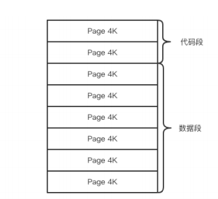
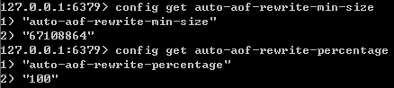
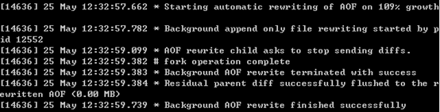
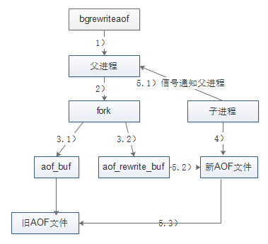
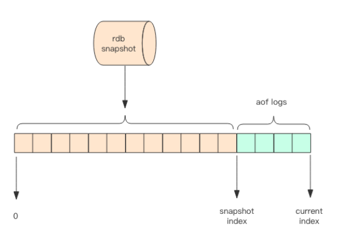
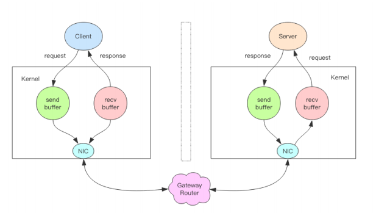
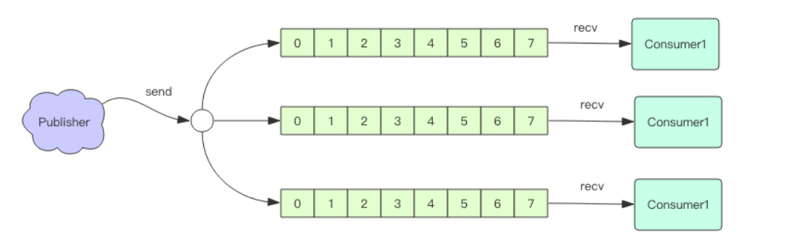
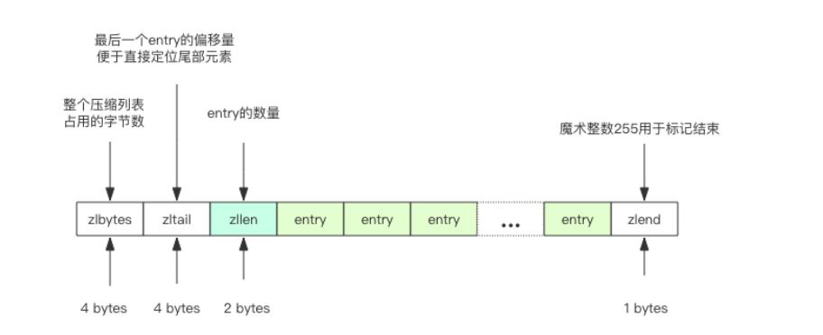
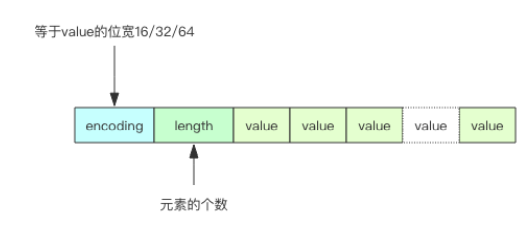

# redis 第二篇 原理篇

[toc]

## 2. 1线程io模型

redis是个单线程程序（在6.0版本引入了多线程，需要手动开启）

redis运行快的原因是所有的数据都在内存中，所有的运算都是内存级别的运算。

单线程的redis能处理大量的并发客户端的原因是 多路复用，

### 2.1.1 阻塞i/o与非阻塞I/o

- 阻塞i/o

编程中调用套接字方法，往往是阻塞的，比如使用read方法去读，但是此时没有数据，线程就会阻塞，直到新的数据到来或者连接关闭，read方法才返回。


在需要处理多个客户端任务时，往往不使用阻塞I/o

- 非阻塞i/o

非阻塞i/o的读写方法不会阻塞，而是能读多少读多少，能写多少写多少，取决于内核为套接字分配的空间。

但是非阻塞i/o有个问题，当一个线程读了一部分数据返回后，线程不知道何时继续读

或者当线程写完一部分数据，缓冲区满了，剩下的数据线程不知道何时去写。

即 线程需要得到通知。----事件轮询api可以解决这个问题

### 2.1.3事件轮询（多路复用）


select函数是操作系统提供给用户程序的api,

输入读写描述符列表read_fds write_fds,和timeout参数，

输出可读可写事件。

若没有任何事件到来，最多等该timeout时间，线程处于阻塞状态。

redis拿到时间后，会依次处理完相应事件，处理完继续轮询，于是线程就进入了死循环，这个死循环就是事件循环。

#### redis io多路复用程序的实现

![digraph {    label = "图 IMAGE_MULTI_LIB    Redis 的 I/O 多路复用程序有多个 I/O 多路复用库实现可选";    node [shape = box];    io_multiplexing [label = "I/O 多路复用程序"];    subgraph cluster_imp {        style = dashed        label = "底层实现";        labelloc = "b";        kqueue [label = "kqueue"];        evport [label = "evport"];        epoll [label = "epoll"];        select [label = "select"];    }    //    edge [dir = back];    io_multiplexing -> select;    io_multiplexing -> epoll;    io_multiplexing -> evport;    io_multiplexing -> kqueue;}](C:\Users\46782\Desktop\redis\redisnotes\redistheory.assets\graphviz-840bfb6ea3cc590829fecd9b9062002d59dbf673.png)

Redis的I/O多路复用程序的所有功能是通过包装select、epoll、evport和kqueue这些I/O多路复用函数库来实现的，每个I/O多路复用函数库在Redis源码中都对应一个单独的文件，比如ae_select.c、ae_epoll.c、ae_kqueue.c等。

因为Redis为每个I/O多路复用函数库都实现了相同的API，所以I/O多路复用程序的底层实现是可以互换的

Redis在I/O多路复用程序的实现源码中用#include宏定义了相应的规则，程序会在编译时自动选择系统中性能最好的I/O多路复用函数库来作为Redis的I/O多路复用程序的底层实现：

```c++
/* Include the best multiplexing layer supported by this system.
 * The following should be ordered by performances, descending. */
#ifdef HAVE_EVPORT
#include "ae_evport.c"
#else
    #ifdef HAVE_EPOLL
    #include "ae_epoll.c"
    #else
        #ifdef HAVE_KQUEUE
        #include "ae_kqueue.c"
        #else
        #include "ae_select.c"
        #endif
    #endif
#endif

```

Redis 会优先选择时间复杂度为 O(1) 的 I/O 多路复用函数作为底层实现，包括 Solaries 10 中的 `evport`、Linux 中的 `epoll` 和 macOS/FreeBSD 中的 `kqueue`，上述的这些函数都使用了内核内部的结构，并且能够服务几十万的文件描述符。

但是如果当前编译环境没有上述函数，就会选择 `select` 作为备选方案，由于其在使用时会扫描全部监听的描述符，所以其时间复杂度较差 O(n)，并且只能同时服务 1024 个文件描述符，所以一般并不会以 `select` 作为第一方案使用。select作为保底供选择


### 2.1.4 指令队列

redis将客户端套接字都关联到一个指令队列里，客户端的指令通过队列来排队进行顺序处理，先到先服务。

### 2.1.5 响应队列

redis为每个客户端套接字关联一个响应队列。redis服务器通过响应队列将指令的返回结果恢复给客户端，

若队列为空，意味着连着暂时处于空闲状态，不需要获取写事件，即可将当前客户端描述符从write_fds里移出来，等有了数据，再放进去。目的是防止select系统调用立即返回写事件，但是缺没有数据可写，造成cpu消耗提升。

### 2.1.6 定时任务 

线程阻塞在select系统调用上，定时任务将无法得到准时调度。

redis通过将定时任务记录在一个称为”最小堆“的数据结构中 解决这个问题。

在堆中，最快要执行的任务排在堆的最上方。在每个循环周期里，redis会对最小堆里面已经到达时间点的任务进行处理。

处理完毕后，将最快要执行任务还需要的事件记录下来，作为select系统调用的timeout参数。


### 2.1.7 redis文件处理器 


Redis基于Reactor模式开发了网络事件处理器，这个处理器被称为文件事件处理器。它的组成结构为4部分：

- 多个套接字、
- I/O多路复用程序、
- 文件事件分派器。因为文件事件分派器队列的消费是单线程的，所以Redis才叫单线程模型。
- 事件处理器。

尽管多个文件事件可能会并发地出现，但I/O多路复用程序总是会将所有产生事件的套接字都推到一个队列里面，然后通过这个队列，以有序（sequentially）、同步（synchronously）、每次一个套接字的方式向文件事件分派器传送套接字：当上一个套接字产生的事件被处理完毕之后（该套接字为事件所关联的事件处理器执行完毕）， I/O多路复用程序才会继续向文件事件分派器传送下一个套接字

#### 文件事件的类型

I/O 多路复用程序可以监听多个套接字的ae.h/AE_READABLE事件和ae.h/AE_WRITABLE事件，这两类事件和套接字操作之间的对应关系如下：

- 当套接字变得可读时（客户端对套接字执行write操作，或者执行close操作），或者有新的可应答（acceptable）套接字出现时（客户端对服务器的监听套接字执行connect操作），套接字产生AE_READABLE 事件。
- 当套接字变得可写时（客户端对套接字执行read操作），套接字产生AE_WRITABLE事件。I/O多路复用程序允许服务器同时监听套接字的AE_READABLE事件和AE_WRITABLE事件，如果一个套接字同时产生了这两种事件，那么文件事件分派器会优先处理AE_READABLE事件，等到AE_READABLE事件处理完之后，才处理AE_WRITABLE 事件。这也就是说，如果一个套接字又可读又可写的话，那么服务器将先读套接字，后写套接字。

#### 文件事件的处理器

Redis为文件事件编写了多个处理器，这些事件处理器分别用于实现不同的网络通讯需求，常用的处理器如下：

- 为了对连接服务器的各个客户端进行应答， 服务器要为监听套接字关联连接应答处理器。
- 为了接收客户端传来的命令请求， 服务器要为客户端套接字关联命令请求处理器。
- 为了向客户端返回命令的执行结果， 服务器要为客户端套接字关联命令回复处理器。

##### 连接应答处理器

networking.c中acceptTcpHandler函数是Redis的连接应答处理器，这个处理器用于对连接服务器监听套接字的客户端进行应答，具体实现为sys/socket.h/accept函数的包装。

当Redis服务器进行初始化的时候，程序会将这个连接应答处理器和服务器监听套接字的AE_READABLE事件关联起来，当有客户端用sys/socket.h/connect函数连接服务器监听套接字的时候， 套接字就会产生AE_READABLE 事件， 引发连接应答处理器执行， 并执行相应的套接字应答操作，如图所示。


##### 命令请求处理器

networking.c中readQueryFromClient函数是Redis的命令请求处理器，这个处理器负责从套接字中读入客户端发送的命令请求内容， 具体实现为unistd.h/read函数的包装。

当一个客户端通过连接应答处理器成功连接到服务器之后， 服务器会将客户端套接字的AE_READABLE事件和命令请求处理器关联起来，当客户端向服务器发送命令请求的时候，套接字就会产生 AE_READABLE事件，引发命令请求处理器执行，并执行相应的套接字读入操作，如图所示。


在客户端连接服务器的整个过程中，服务器都会一直为客户端套接字的AE_READABLE事件关联命令请求处理器。

##### 命令回复处理器

networking.c中sendReplyToClient函数是Redis的命令回复处理器，这个处理器负责将服务器执行命令后得到的命令回复通过套接字返回给客户端，具体实现为unistd.h/write函数的包装。

当服务器有命令回复需要传送给客户端的时候，服务器会将客户端套接字的AE_WRITABLE事件和命令回复处理器关联起来，当客户端准备好接收服务器传回的命令回复时，就会产生AE_WRITABLE事件，引发命令回复处理器执行，并执行相应的套接字写入操作， 如图所示。


当命令回复发送完毕之后， 服务器就会解除命令回复处理器与客户端套接字的 AE_WRITABLE 事件之间的关联。


### 一次完整的客户端与服务器连接事件示例

假设Redis服务器正在运作，那么这个服务器的监听套接字的AE_READABLE事件应该正处于监听状态之下，而该事件所对应的处理器为连接应答处理器。

如果这时有一个Redis客户端向Redis服务器发起连接，那么监听套接字将产生AE_READABLE事件， 触发连接应答处理器执行：处理器会对客户端的连接请求进行应答， 然后创建客户端套接字，以及客户端状态，并将客户端套接字的 AE_READABLE 事件与命令请求处理器进行关联，使得客户端可以向主服务器发送命令请求。

之后，客户端向Redis服务器发送一个命令请求，那么客户端套接字将产生 AE_READABLE事件，引发命令请求处理器执行，处理器读取客户端的命令内容， 然后传给相关程序去执行。

执行命令将产生相应的命令回复，为了将这些命令回复传送回客户端，服务器会将客户端套接字的AE_WRITABLE事件与命令回复处理器进行关联：当客户端尝试读取命令回复的时候，客户端套接字将产生AE_WRITABLE事件， 触发命令回复处理器执行， 当命令回复处理器将命令回复全部写入到套接字之后， 服务器就会解除客户端套接字的AE_WRITABLE事件与命令回复处理器之间的关联。


参考： 

1 链接：https://juejin.im/post/6844903970511519758

2 链接：https://draveness.me/redis-io-multiplexing/


## 2.2 通信协议

### 2.2.1 RESP (Redis Serialization Protocol)

RESP 是 Redis 序列化协议的简写。它是一种直观的文本协议，优势在于实现异常简 单，解析性能极好

Redis 协议将传输的结构数据分为 5 种最小单元类型，单元结束时统一加上回车换行符 号\r\n。 

- 单行字符串 以 + 符号开头。 

eg：**单行字符串** hello world   `+hello world\r\n`

- 多行字符串 以 $ 符号开头，后跟字符串长度。 多行字符串当然也可以表示单行字符串。

eg1：**多行字符串** hello world  `$11\r\nhello world\r\n `

eg2:**NULL**  用多行字符串表示，不过长度要写成-1。 `$-1\r\n `

eg3:**空串**  用多行字符串表示，长度填 0。 `$0\r\n\r\n` 

 注意这里有两个\r\n的原因是两个\r\n 之间,隔的是空串。

- 整数值 以 : 符号开头，后跟整数的字符串形式。 

eg：**整数** 1024  ` :1024\r\n `

- 错误消息 以 - 符号开头。

eg:**错误**  参数类型错误

` -WRONGTYPE Operation against a key holding the wrong kind of value `

- 数组 以 * 号开头，后跟数组的长度。

eg:**数组** [1,2,3]   ` *3\r\n:1\r\n:2\r\n:3\r\n `


 ### 客户端->服务端

客户端向服务器发送的指令只有一种格式，多行字符串数组。比如一个简单的 set 指令 `set author codehole` 会被序列化成下面的字符串。

`*3\r\n$3\r\nset\r\n$6\r\nauthor\r\n$8\r\ncodehole\r\n`

在控制台输出这个字符串如下，可以看出这是很好阅读的一种格式。

```
$3
set
$6
author
$8
codehole
```

### 服务端->客户端

服务器向客户端回复的响应要支持多种数据结构，所以消息响应在结构上要复杂不少。 不过再复杂的响应消息也是以上 5 中基本类型的组合。

##### 单行字符串响应

```
127.0.0.1:6379> set author codehole 
OK
```

这里的 OK 就是单行响应，没有使用引号括起来。 +OK

##### 错误响应

```
127.0.0.1:6379> incr author
(error) ERR value is not an integer or out of range
```

试图对一个字符串进行自增，服务器抛出一个通用的错误。 

-ERR value is not an integer or out of range

##### 整数响应

```
127.0.0.1:6379> incr books
(integer) 1

```

这里的 1 就是整数响应 :1

##### 多行字符串响应

```
127.0.0.1:6379> get author
"codehole"
```

这里使用双引号括起来的字符串就是多行字符串响应

 $8 

codehole

##### 数据响应

```
127.0.0.1:6379> hset info name laoqian
(integer) 1
127.0.0.1:6379> hset info age 30
(integer) 1
127.0.0.1:6379> hset info sex male
(integer) 1
127.0.0.1:6379> hgetall info
1) "name"
2) "laoqian"
3) "age"
4) "30"
5) "sex"
6) "male"

```

这里的 hgetall 命令返回的就是一个数值，第 0|2|4 位置的字符串是 hash 表的 key，第 1|3|5 位置的字符串是 value，客户端负责将数组组装成字典再返回。

```
*6
$4
name
$6
laoqian
$3
age
$2
30
$3
sex
$4
male
```

##### 嵌套

```
127.0.0.1:6379> scan 0
1) "0"
2) 1) "info"
 2) "books"
 3) "author"
```

scan 命令用来扫描服务器包含的所有 key 列表，它是以游标的形式获取，一次只获取 一部分。

 scan 命令返回的是一个嵌套数组。数组的第一个值表示游标的值，如果这个值为零，说 明已经遍历完毕。如果不为零，使用这个值作为 scan 命令的参数进行下一次遍历。数组的 第二个值又是一个数组，这个数组就是 key 列表。

```
*2
$1
0
*3
$4
info
$5
books
$6
autho
```

## 2.3 持久化

redis的持久化机制保证redis数据不会因为故障而丢失

1. 快照（RDB文件）—— 一次全量备份

   快照是内存数据的二进制序列化形式，存储上非常紧凑。

   会在一个特定的间隔保存那个时间点的一个数据快照。

2. 追加式（AOF日志）—— 连续的增量备份

   APF日志记录内存数据修改的指令记录文本。

   记录每一个服务器收到的写操作。在服务启动时，这些记录的操作会逐条执行从而重建出原来的数据。写操作命令记录的格式跟Redis协议一致，以追加的方式进行保存。

   AOF日志在长期运行过程中，累积导致数据无比庞大，数据库重启时加载aof日志进行指令重写的时间会很长，故需要定期进行AOf重写，对其瘦身

- Redis的持久化是可以禁用的，就是说你可以让数据的生命周期只存在于服务器的运行时间里
- 两种方式的持久化是可以同时存在的，但是当Redis重启时，AOF文件会被优先用于重建数据

### 2.3.1 快照 redis database

redis通过使用操作系统的多进程COW（copy on write）机制来实现快照持久化

考虑两个问题

- redis需要一边做持久化，一边响应客户端的请求

  RDB的持久化机制会阻塞主进程（save）导致主进程无法响应客户端请求

- 出于性能考虑，如果在主进程内启动一个线程，这样会造成对数据的竞争条件，为了避免使用锁降低性能

#### RDB的创建与载入

- `SAVE`：阻塞redis的**服务器进程**，直到`RDB文件`被创建完毕。
- `BGSAVE`：派生(fork)一个子进程来创建新的`RDB文件`，记录接收到`BGSAVE`当时的数据库状态，父进程继续处理接收到的命令，子进程完成文件的创建之后，会**发送信号**给父进程，而与此同时，父进程处理命令的同时，通过**轮询**来接收子进程的信号。

这两个命令可生成RDB文件

而RDB文件的载入一般情况是自动的，redis服务器启动的时候，`redis`服务器再启动的时候如果检测到RDB文件的存在，那么redis会自动载入这个文件。

由于`save`会阻塞服务器进程，一般不在线上环境使用

`BGSAVE`可以一边做数据持久化，一边响应客户端的请求，

通过`redis.conf`设置多个自动保存条件，只要有一个被满足服务器就会执行`bgsave`指令

```bash
# save m n 
# 以下配置表示的条件： 
# 服务器在900秒之内被修改了1次
save 900 1
# 服务器在300秒之内被修改了10次
save 300 10
# 服务器在60秒之内被修改了10000次
save 60 10000
```


图片中的5个步骤所进行的操作如下：

1. Redis父进程首先判断：当前是否在执行save，或bgsave/bgrewriteaof（后面会详细介绍该命令）的子进程，如果在执行则bgsave命令直接返回。bgsave/bgrewriteaof 的子进程不能同时执行，主要是基于性能方面的考虑：两个并发的子进程同时执行大量的磁盘写操作，可能引起严重的性能问题。

2. 父进程执行fork操作创建子进程，这个过程中父进程是阻塞的，Redis不能执行来自客户端的任何命令
3. 父进程fork后，bgsave命令返回”Background saving started”信息并不再阻塞父进程，并可以响应其他命令
4. 子进程创建RDB文件，根据父进程内存快照生成临时快照文件，完成后对原有文件进行原子替换
5. 子进程发送信号给父进程表示完成，父进程更新统计信息

#### fork(多进程)

redis在持久化时，会调用glibc的函数fork产生一个子进程。持久化由子进程进行，父进程处理客户端响应。

子进程刚产生时，与父进程共享内存的代码段和数据段。但两个进程分离时，内存不会突然增加。

子进程对内存数据结构进行遍历读取然后序列化保存到磁盘中。

父进程持续响应客户端的请求可能会更改内存数据结构。

操作系统的cow机制来进行数据段页面的分离。当父进程对其中一个页面进行分离时，

会将被共享的页面复制一份出来，在复制出来的页面上进行修改。对于子进程来说对应的那个页面没有被修改。也就是说，在数据持久化期间修改的数据，不会被持久化到磁盘里。reids持久化的是在fork的那一瞬间内存中的数据，就像照片，定格在那一刻，即叫"快照"



虽然父进程持续修改数据，会有更多的页面被复制出来，内存逐渐增长，但是不会超过原有的内存二倍大小。往往被分离的页面只占很少其中一部分

#### 优点

- RDB文件是一个很简洁的单文件，它保存了某个时间点的Redis数据，很适合用于做备份。你可以设定一个时间点对RDB文件进行归档，这样就能在需要的时候很轻易的把数据恢复到不同的版本。
- 基于上面所描述的特性，RDB很适合用于灾备。单文件很方便就能传输到远程的服务器上。
- RDB的性能很好，需要进行持久化时，主进程会fork一个子进程出来，然后把持久化的工作交给子进程，自己不会有相关的I/O操作。
- 比起AOF，在数据量比较大的情况下，RDB的启动速度更快。

#### 缺点

- RDB容易造成数据的丢失。假设每5分钟保存一次快照，如果Redis因为某些原因不能正常工作，那么从上次产生快照到Redis出现问题这段时间的数据就会丢失了。
- RDB使用`fork()`产生子进程进行数据的持久化，如果数据比较大的话可能就会花费点时间，造成Redis停止服务几毫秒。如果数据量很大且CPU性能不是很好的时候，停止服务的时间甚至会到1秒。


### 2.2.3 AOF Append Only File

AOF 日志存储的是 Redis 服务器的顺序指令序列，AOF 日志只记录对内存进行修改的 指令(和参数)记录。

与leveldb、Hbase等存储引擎不同，redis将收到的指令先执行 再进行日志记录。

#### aof执行流程

- 命令追加(append)：将Redis的写命令追加到缓冲区aof_buf；
- 文件写入(write)和文件同步(sync)：根据不同的同步策略将aof_buf中的内容同步到硬盘；
- 文件重写(rewrite)：定期重写AOF文件，达到压缩的目的。

##### 命令追加

Redis先将写命令追加到缓冲区，而不是直接写入文件，主要是为了避免每次有写命令都直接写入硬盘，导致硬盘IO成为Redis负载的瓶颈。

命令追加的格式是Redis命令请求的协议格式，它是一种纯文本格式，具有兼容性好、可读性强、容易处理、操作简单避免二次开销等优点；具体格式略。在AOF文件中，除了用于指定数据库的select命令（如select 0 为选中0号数据库）是由Redis添加的，其他都是客户端发送来的写命令。

##### 文件写入(write)和文件同步(sync)

Redis提供了多种AOF缓存区的同步文件策略，策略涉及到操作系统的write函数和fsync函数，说明如下：

为了提高文件写入效率，在现代操作系统中，当用户调用write函数将数据写入文件时，操作系统通常会将数据暂存到一个内存缓冲区里，当缓冲区被填满或超过了指定时限后，才真正将缓冲区的数据写入到硬盘里。这样的操作虽然提高了效率，但也带来了安全问题：如果计算机停机，内存缓冲区中的数据会丢失；因此系统同时提供了fsync、fdatasync等同步函数，可以强制操作系统立刻将缓冲区中的数据写入到硬盘里，从而确保数据的安全性。

Linux 的 glibc 提供了 fsync(int fd)函数可以将指定文件的内容强制从内核缓存刷到磁 盘。只要 Redis 进程实时调用 fsync 函数就可以保证 aof 日志不丢失。但是fsync是磁盘io操作，高频率的调用会导致redis性能性能下降。在生产环境中，redis每隔一秒，调用一次fsync()

AOF缓存区的同步文件策略由参数appendfsync控制，各个值的含义如下：

- always：命令写入aof_buf后立即调用系统fsync操作同步到AOF文件，fsync完成后线程返回。这种情况下，每次有写命令都要同步到AOF文件，硬盘IO成为性能瓶颈，Redis只能支持大约几百TPS写入，严重降低了Redis的性能；即便是使用固态硬盘（SSD），每秒大约也只能处理几万个命令，而且会大大降低SSD的寿命。
- no：命令写入aof_buf后调用系统write操作，不对AOF文件做fsync同步；同步由操作系统负责，通常同步周期为30秒。这种情况下，文件同步的时间不可控，且缓冲区中堆积的数据会很多，数据安全性无法保证。
- everysec：命令写入aof_buf后调用系统write操作，write完成后线程返回；fsync同步文件操作由专门的线程每秒调用一次。everysec是前述两种策略的折中，是性能和数据安全性的平衡，因此是Redis的默认配置，也是我们推荐的配置。

##### 文件重写

redis在长期的运行过程中，aof日志会累积越来越多。若宕机重启，重放整个AOF文件会非常耗时，导致redis一段时间内无法对外提供服务。

需要对aof文件重写，通过定期重写aof文件，减小aof文件的体积

AOF重写是把Redis进程内的数据转化为写命令，同步到新的AOF文件；不会对旧的AOF文件进行任何读取、写入操作

是开辟一个子进 程对内存进行遍历转换成一系列 Redis 的操作指令，序列化到一个新的 AOF 日志文件中。 序列化完毕后再将操作期间发生的增量 AOF 日志追加到这个新的 AOF 日志文件中，追加 完毕后就立即替代旧的 AOF 日志文件了

文件重写能够压缩aof文件的原因：

1. 过期的数据不再写入文件
2. 无效的命令不再写入文件：如有些数据被重复设值(set mykey v1, set mykey v2)、有些数据被删除了(sadd myset v1, del myset)等等
3. 多条命令可以合并为一个：如sadd myset v1, sadd myset v2, sadd myset v3可以合并为sadd myset v1 v2 v3。不过为了防止单条命令过大造成客户端缓冲区溢出，对于list、set、hash、zset类型的key，并不一定只使用一条命令；而是以某个常量为界将命令拆分为多条。这个常量在redis.h/REDIS_AOF_REWRITE_ITEMS_PER_CMD中定义，不可更改，3.0版本中值是64。

文件重写后，减少了内存占用，恢复速度也变短了。

文件重写可以通过手动或者自动触发两种方式。

- 手动触发：直接调用bgrewriteaof命令，该命令的执行与bgsave有些类似：都是fork子进程进行具体的工作，且都只有在fork时阻塞。

- 自动触发：根据auto-aof-rewrite-min-size和auto-aof-rewrite-percentage参数，以及aof_current_size和aof_base_size状态确定触发时机。

  - auto-aof-rewrite-min-size：执行AOF重写时，文件的最小体积，默认值为64MB。

  - auto-aof-rewrite-percentage：执行AOF重写时，当前AOF大小(即aof_current_size)和上一次重写时AOF大小(aof_base_size)的比值。

    其中，参数可以通过config get命令查看：



​			状态可以通过info persistence查看：


​			只有当auto-aof-rewrite-min-size和auto-aof-rewrite-percentage两个参数同时满足时，才会自动触发AOF重写，即bgrewriteaof操作。

​			自动触发bgrewriteaof时，可以看到服务器日志如下：



文件重写流程：



关于文件重写的流程，有两点需要特别注意：

- 重写由父进程fork子进程进行；
- 重写期间Redis执行的写命令，需要追加到新的AOF文件中，为此Redis引入了aof_rewrite_buf缓存。

对照上图，文件重写的流程如下：

1. Redis父进程首先判断当前是否存在正在执行 bgsave/bgrewriteaof的子进程，如果存在则bgrewriteaof命令直接返回，如果存在bgsave命令则等bgsave执行完成后再执行。前面曾介绍过，这个主要是基于性能方面的考虑。

2. 父进程执行fork操作创建子进程，这个过程中父进程是阻塞的。

3. 1. 父进程fork后，bgrewriteaof命令返回”Background append only file rewrite started”信息并不再阻塞父进程，并可以响应其他命令。**Redis的所有写命令依然写入AOF缓冲区，并根据appendfsync策略同步到硬盘，保证原有AOF机制的正确。**
   2. 由于fork操作使用写时复制技术，子进程只能共享fork操作时的内存数据。**由于父进程依然在响应命令，因此Redis使用AOF重写缓冲区(图中的aof_rewrite_buf)保存这部分数据，防止新AOF文件生成期间丢失这部分数据。也就是说，bgrewriteaof执行期间，Redis的写命令同时追加到aof_buf和aof_rewirte_buf两个缓冲区。**

4. 子进程根据内存快照，按照命令合并规则写入到新的AOF文件。

5. 1. 子进程写完新的AOF文件后，向父进程发信号，父进程更新统计信息，具体可以通过info persistence查看。
   2. 父进程把AOF重写缓冲区的数据写入到新的AOF文件，这样就保证了新AOF文件所保存的数据库状态和服务器当前状态一致。
   3. 用新的AOF文件替换老文件，完成AOF重写。

#### 优点

- 比RDB可靠。你可以制定不同的fsync策略：不进行fsync、每秒fsync一次和每次查询进行fsync。默认是每秒fsync一次。这意味着你最多丢失一秒钟的数据。
- AOF日志文件是一个纯追加的文件。就算是遇到突然停电的情况，也不会出现日志的定位或者损坏问题。甚至如果因为某些原因（例如磁盘满了）命令只写了一半到日志文件里，我们也可以用`redis-check-aof`这个工具很简单的进行修复。
- 当AOF文件太大时，Redis会自动在后台进行重写。重写很安全，因为重写是在一个新的文件上进行，同时Redis会继续往旧的文件追加数据。新文件上会写入能重建当前数据集的最小操作命令的集合。当新文件重写完，Redis会把新旧文件进行切换，然后开始把数据写到新文件上。
- AOF把操作命令以简单易懂的格式一条接一条的保存在文件里，很容易导出来用于恢复数据。例如我们不小心用`FLUSHALL`命令把所有数据刷掉了，只要文件没有被重写，我们可以把服务停掉，把最后那条命令删掉，然后重启服务，这样就能把被刷掉的数据恢复回来。

#### 缺点

- 在相同的数据集下，AOF文件的大小一般会比RDB文件大。
- 在某些fsync策略下，AOF的速度会比RDB慢。通常fsync设置为每秒一次就能获得比较高的性能，而在禁止fsync的情况下速度可以达到RDB的水平。
- 在过去曾经发现一些很罕见的BUG导致使用AOF重建的数据跟原数据不一致的问题。


### 2.2.3 运维

- 快照是通过开启子进程的方式进行的，遍历整个内存，大块写磁盘会加重系统负载

- AOF 的 fsync 是一个耗时的 IO 操作，它会降低 Redis 性能，同时也会增加系 统 IO 负担

以通常 Redis 的主节点是不会进行持久化操作，持久化操作主要在从节点进行。从节 点是备份节点，没有来自客户端请求的压力，它的操作系统资源往往比较充沛

在生产环境要 做好实时监控工作，保证网络畅通或者能快速修复。另外还应该再增加一个从节点以降低网 络分区的概率，只要有一个从节点数据同步正常，数据也就不会轻易丢失

### 2.2.4 redis 4.0混合持久化

重启redis时 rdb会丢失大量数据，重放AOF又很慢。

redis 4.0 推出了混合持久化。

rdb 文 件的内容和增量的 AOF 日志文件存在一起。这里的 AOF 日志不再是全量的日志，而是自 持久化开始到持久化结束的这段时间发生的增量 AOF 日志，通常这部分 AOF 日志很小。



redis重启时 先加载rdb，再重放增量aof日志，效率可以大幅提高

## 2.4 管道

redis管道由客户端提供

客户端同通过管道中的指令列表改变读写顺序就可以大幅度节省网络i/o时间


### 2.4.1 管道压力测试 

```
(base) digua@digua-virtual-machine:~$ redis-benchmark -t set  -q 
SET: 70871.72 requests per second

(base) digua@digua-virtual-machine:~$ redis-benchmark -t set -P 2 -q 
SET: 141242.94 requests per second

(base) digua@digua-virtual-machine:~$ redis-benchmark -t set -P 3 -q 
SET: 209205.03 requests per second

(base) digua@digua-virtual-machine:~$ redis-benchmark -t set -P 4 -q 
SET: 263157.91 requests per second

(base) digua@digua-virtual-machine:~$ redis-benchmark -t set -P 5 -q 
SET: 289017.34 requests per second

(base) digua@digua-virtual-machine:~$ redis-benchmark -t set -P 6 -q 
SET: 303030.28 requests per second

```

计入-P参数后，管道数越多，QPS越大，当QPS不再增加，说明cpu的处理能力达到了瓶颈。


### 2.4.2 管道的本质



上图就是一个完整的请求交互流程图。

1. 客户端进程调用 write 将消息写到操作系统内核为套接字分配的发送缓冲 send buffer。
2. 客户端操作系统内核将发送缓冲的内容发送到网卡，网卡硬件将数据通过「网际路 由」送到服务器的网卡。
3. 服务器操作系统内核将网卡的数据放到内核为套接字分配的接收缓冲 recv buffer。 
4. 服务器进程调用 read 从接收缓冲中取出消息进行处理。
5. 服务器进程调用 write 将响应消息写到内核为套接字分配的发送缓冲 send buffer。 
6. 服务器操作系统内核将发送缓冲的内容发送到网卡，网卡硬件将数据通过「网际路 由」送到客户端的网卡。
7. 客户端操作系统内核将网卡的数据放到内核为套接字分配的接收缓冲 recv buffer。 
8. 客户端进程调用 read 从接收缓冲中取出消息返回给上层业务逻辑进行处理。 
9. 结束。

- write 操作只负责将数据写到本地操作系统内核的发送缓冲然后就返回了。剩下的事交给操作系统 内核异步将数据送到目标机器。但是如果发送缓冲满了，那么就需要等待缓冲空出空闲空间 来，这个就是写操作 IO 操作的真正耗时。

- read 操作只负 责将数据从本地操作系统内核的接收缓冲中取出来就了事了。但是如果缓冲是空的，那么就 需要等待数据到来，这个就是读操作 IO 操作的真正耗时

eg:

`key=redis.get(key)`

write操作写到发送缓冲就返回，几乎不费时

read比较费时，需要等该消息从缓冲区经过网络发送到目标服务器，目标服务器处理后响应消息，再回到当前内核的读缓冲。

这个一个网络来回的开销。

对于管道来说，连续的wirte几乎没有耗时，之后第一个read操作会等待一个网络的来回开销，然后所有的响应消息都送回到内核的读缓冲了。后续的read直接读即可

也就是说，管道通过改变读写顺序，使得n条命令需要n个网路来回开销减小到1个。带来速度提升。


## 2.5 事务 

事务可以确保连续多个操作的原子性。


### 2.5.1redis事务的基本用法 

- multi：指示事务的开始
- exec：指示事务的执行
- discard :指示事务的丢弃

```bash
127.0.0.1:6379> multi
OK
127.0.0.1:6379> incr books
QUEUED
127.0.0.1:6379> incr books
QUEUED
127.0.0.1:6379> exec 
1) (integer) 1
2) (integer) 2
127.0.0.1:6379> 

```

 所有指令exec前不执行，而是缓存在 服务器的一个事务队列中，服务器一旦收到 exec 指令，才开执行整个事务队列，执行完毕 后一次性返回所有指令的运行结果。

### 2.5.2 原子性

事务的原子性指的是要么全部成功，要么全部失败

```bash
127.0.0.1:6379> multi
OK
127.0.0.1:6379> set books iamastring
QUEUED
127.0.0.1:6379> incr books 
QUEUED
127.0.0.1:6379> set poorman iamdesperate
QUEUED
127.0.0.1:6379> exec 
1) OK
2) (error) ERR value is not an integer or out of range
3) OK
127.0.0.1:6379> get books 
"iamastring"
127.0.0.1:6379> get poorman 
"iamdesperate"

```

事务执行失败后，后面的代码还可以继续执行，即Redis 的事务根本不能算「原子性」，而仅仅是满足了事务的「隔 离性」，隔离性中的串行化——当前执行的事务有着不被其它事务打断的权利

### 2.5.3 discard 丢弃 

discard可以丢弃事务缓冲中的所有指令，在exec之前

```
127.0.0.1:6379> get books
(nil)
127.0.0.1:6379> multi 
OK
127.0.0.1:6379> incr books 
QUEUED
127.0.0.1:6379> incr books 
QUEUED
127.0.0.1:6379> discard 
OK
127.0.0.1:6379> get books 
(nil)

```

### 2.5.4 优化

redis发送每个指令到事务缓存队列都需要经过一次网络读写。通常结合pipeline一起使用。

```python
pipe = redis.pipeline(transaction=true)
pipe.multi()
pipe.incr("books")
pipe.incr("books")
values = pipe.execute()
```

### 2.5.5 watch

redis 分布式锁是悲观锁 

redis提供watch机制，一种乐观锁，解决并发修改问题

watch使用方式：

```
while True:
	do_watch()
	commands()
	multi()
	send_commands()
	try:
		exec()
		break
	except WatchError:
		continu
```

watch 会在事务开始之前盯住 1 个或多个关键变量，当事务执行时，也就是服务器收到 了 exec 指令要顺序执行缓存的事务队列时，Redis 会检查关键变量自 watch 之后，是否被 修改了 (包括当前事务所在的客户端)。如果关键变量被人动过了，exec 指令就会返回 null 回复告知客户端事务执行失败，这个时候客户端一般会选择重试。

```bash
127.0.0.1:6379> watch books
OK
127.0.0.1:6379> incr books 
(integer) 1            # 被修改
127.0.0.1:6379> multi 
OK
127.0.0.1:6379> incr books
QUEUED
127.0.0.1:6379> exec 
(nil) 					# 事务执行失败
127.0.0.1:6379> 

```

### 2.5.6 注意事项 

Redis 禁止在 multi 和 exec 之间执行 watch 指令，而必须在 multi 之前做好盯住关键 变量，否则会出错。

使用python 对余额进行加倍

```
import redis
from redis import client


def key_for(user_id):
    return "account_{}".format(user_id)

def double_account(client:redis.StrictRedis,user_id:str):
    key=key_for(user_id)
    while True:
        client.watch(key)
        value=int(client.get(key))
        value*=2
        pipe=client.pipeline(transaction=True)
        pipe.multi()
        pipe.set(key,value)
        try:
            pipe.execute()
            break
        except redis.WatchError:
            continue
    return int(client.get(key))

client=redis.StrictRedis()
user_id="abc"
client.setnx(key_for(user_id),5)
print(double_account( client,user_id))
```

## 2.6 PubSub

### 2.6.1 消息多播

消息多播允许生产者生产一次消息，中间件负责将消息复制到多个消息队列，每个消息 队列由相应的消费组进行消费。它是分布式系统常用的一种解耦方式，用于将多个消费组的 逻辑进行拆分。支持了消息多播，多个消费组的逻辑就可以放到不同的子系统中。



### 2.6.2 PubSub

Redis 使用PubSub （publisherSubscriber）模块支持消息多播，发布者/订阅者模型


#### 消费者 

```python
import redis 

client=redis.StrictRedis()
p=client.pubsub()
p.subscribe("codehole")
for msg in p.listen():
    print(msg)
```

#### 生产者 

```python
import redis 

client=redis.StrictRedis()
client.publish("codehole", "java comes")
client.publish("codehole", "python comes")
client.publish("codehole", "golang comes")

```

先启动消费者，再启动生产者，可以启动多个生产者


### 2.6.3 订阅模式 

消费者订阅一个主题是必须明确指定主题的名 称。如果我们想要订阅多个主题，那就 subscribe 多个名称。

```bash
> subscribe codehole.image codehole.text codehole.blog # 同时订阅三个主题，会有三条订阅成功反
馈信息
1) "subscribe"
2) "codehole.image"
3) (integer) 1
1) "subscribe"
2) "codehole.text"
3) (integer) 2
1) "subscribe"
2) "codehole.blog"
3) (integer) 3

```

这样生产者向这三个主题发布的消息，这个消费者都可以接收到。

```bash
> publish codehole.image https://www.google.com/dudo.png
(integer) 1
> publish codehole.text " 你好，欢迎加入码洞 "
(integer) 1
> publish codehole.blog '{"content": "hello, everyone", "title": "welcome"}'
(integer) 1
```

如果现在要增加一个主题 codehole.group，客户端必须也跟着增加一个订阅指令才可以收 到新开主题的消息推送。 为了简化订阅的繁琐，redis 提供了模式订阅功能 Pattern Subscribe，这样就可以一次订 阅多个主题，即使生产者新增加了同模式的主题，消费者也可以立即收到消息

```bash
> psubscribe codehole.* # 用模式匹配一次订阅多个主题，主题以 codehole. 字符开头的消息都可
以收到
1) "psubscribe"
2) "codehole.*"
3) (integer) 1
```

### 2.6.4 消息结构 

```
{'pattern': None, 'type': 'subscribe', 'channel': 'codehole', 'data': 1L}
{'pattern': None, 'type': 'message', 'channel': 'codehole', 'data': 'python comes'}
{'pattern': None, 'type': 'message', 'channel': 'codehole', 'data': 'java comes'}
{'pattern': None, 'type': 'message', 'channel': 'codehole', 'data': 'golang comes'}
```

data 这个毫无疑问就是消息的内容，一个字符串。

channel 表示当前订阅的主题名称。

type 它表示消息的类型，如果是一个普通的消息，那么类型就是 message，如果是控制 消息，比如订阅指令的反馈，它的类型就是 subscribe，如果是模式订阅的反馈，它的类型就 是 psubscribe，还有取消订阅指令的反馈 unsubscribe 和 punsubscribe。 

pattern 它表示当前消息是使用哪种模式订阅到的，如果是通过 subscribe 指令订阅的， 那么这个字段就是空。

### 2.6.5 pubsub缺点 

PubSub 的生产者传递过来一个消息，Redis 会直接找到相应的消费者传递过去。如果一 个消费者都没有，那么消息直接丢弃。如果开始有三个消费者，一个消费者突然挂掉了，生 产者会继续发送消息，另外两个消费者可以持续收到消息。但是挂掉的消费者重新连上的时 候，这断连期间生产者发送的消息，对于这个消费者来说就是彻底丢失了。

 如果 Redis 停机重启，PubSub 的消息是不会持久化的，毕竟 Redis 宕机就相当于一个 消费者都没有，所有的消息直接被丢弃。

期 Redis5.0 新增了 Stream 数据结构，这个功能给 Redis 带来了持久化消息队列， 从此 PubSub 可以消失了


## 2.7 小对象压缩 

### 2.7.1 32bitvs64bit 

Redis 如果使用 32bit 进行编译，内部所有数据结构所使用的指针空间占用会少一半， 如果你对 Redis 使用内存不超过 4G，可以考虑使用 32bit 进行编译，可以节约大量内存。 4G 的容量作为一些小型站点的缓存数据库是绰绰有余了，如果不足还可以通过增加实例的 方式来解决。

### 2.7.2 小对象压缩存储  ziplist


如果 Redis 内部管理的集合数据结构很小，它会使用紧凑存储形式压缩存储



如果它存储的是 hash 结构，那么 key 和 value 会作为两个 entry 相邻存在一起。

```bash
127.0.0.1:6379> hset hello a 1
(integer) 1
127.0.0.1:6379> hset hello b 2
(integer) 1
127.0.0.1:6379> hset hello c 3
(integer) 1
127.0.0.1:6379> object encoding hello
"ziplist
```

如果它存储的是 zset，那么 value 和 score 会作为两个 entry 相邻存在一起。

```bash
127.0.0.1:6379> zadd world 1 a
(integer) 1
127.0.0.1:6379> zadd world 2 b
(integer) 1
127.0.0.1:6379> zadd world 3 c
(integer) 1
127.0.0.1:6379> object encoding world
"ziplist"
```

Redis 的 intset 是一个紧凑的整数数组结构，它用于存放元素都是整数的并且元素个数 较少的 set 集合。 如果整数可以用 uint16 表示，那么 intset 的元素就是 16 位的数组，如果新加入的整 数超过了 uint16 的表示范围，那么就使用 uint32 表示，如果新加入的元素超过了 uint32 的表示范围，那么就使用 uint64 表示，Redis 支持 set 集合动态从 uint16 升级到 uint32， 再升级到 uint64。



```
127.0.0.1:6379> sadd hello 1 2 3
(integer) 3
127.0.0.1:6379> object encoding hello
"intset"
```

如果 set 里存储的是字符串，那么 sadd 立即升级为 hashtable 结构。

```bash
127.0.0.1:6379> sadd hello yes no
(integer) 2
127.0.0.1:6379> object encoding hello
"hashtable"

```

存储界限 当集合对象的元素不断增加，或者某个 value 值过大，这种小对象存储也会 被升级为标准结构。

```bash
Redis 规定在小对象存储结构的限制条件如下：
hash-max-zipmap-entries 512 # hash 的元素个数超过 512 就必须用标准结构存储
hash-max-zipmap-value 64 # hash 的任意元素的 key/value 的长度超过 64 就必须用标准结构存储
list-max-ziplist-entries 512 # list 的元素个数超过 512 就必须用标准结构存储
list-max-ziplist-value 64 # list 的任意元素的长度超过 64 就必须用标准结构存储
zset-max-ziplist-entries 128 # zset 的元素个数超过 128 就必须用标准结构存储
zset-max-ziplist-value 64 # zset 的任意元素的长度超过 64 就必须用标准结构存储
set-max-intset-entries 512 # set 的整数元素个数超过 512 就必须用标准结构存储

```


### 2.7.3 内存回收机制

Redis 并不总是可以将空闲内存立即归还给操作系统。

如果当前 Redis 内存有 10G，当你删除了 1GB 的 key 后，再去观察内存，你会发现 内存变化不会太大。原因是操作系统回收内存是以页为单位，如果这个页上只要有一个 key 还在使用，那么它就不能被回收。Redis 虽然删除了 1GB 的 key，但是这些 key 分散到了 很多页面中，每个页面都还有其它 key 存在，这就导致了内存不会立即被回收。 

如果你执行 flushdb，然后再观察内存会发现内存确实被回收了。原因是所有的 key 都干掉了，大部分之前使用的页面都完全干净了，会立即被操作系统回收。 Redis 虽然无法保证立即回收已经删除的 key 的内存，但是它会重用那些尚未回收的空闲内存。

这就好比电影院里虽然人走了，但是座位还在，下一波观众来了，直接坐就行。而 操作系统回收内存就好比把座位都给搬走了。

### 2.7.4 内存分配算法 

Redis 为了保持自身结构的简单性，在内存分配这里直接做了甩手掌柜，将内存分配的 细节丢给了第三方内存分配库去实现。目前 Redis 可以使用 jemalloc(facebook) 库来管理内 存，也可以切换到 tcmalloc(google)。因为 jemalloc 相比 tcmalloc 的性能要稍好一些，所以 Redis 默认使用了 jemallo